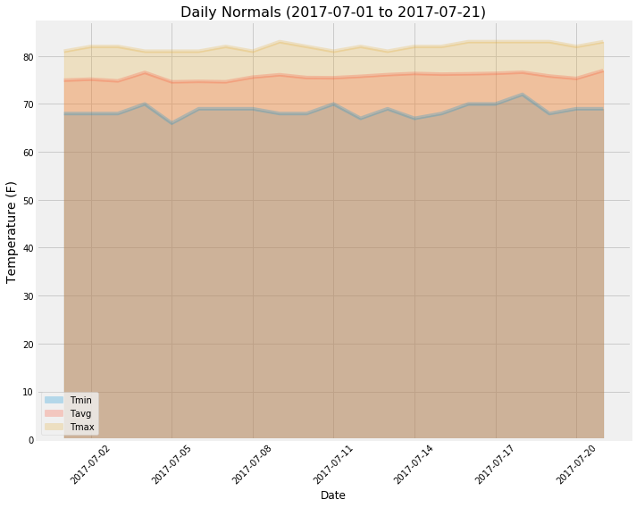

# Importing Dependencies


```python
%matplotlib inline
from matplotlib import style
style.use('fivethirtyeight')
import matplotlib.pyplot as plt
import matplotlib.dates as mdates
```


```python
import numpy as np
import pandas as pd
```


```python
import datetime as dt
from dateutil.relativedelta import relativedelta
```

# Reflect Tables into SQLAlchemy ORM


```python
# Python SQL toolkit and Object Relational Mapper
import sqlalchemy
from sqlalchemy.ext.automap import automap_base
from sqlalchemy.orm import Session
from sqlalchemy import inspect, create_engine, func, and_
```


```python
engine = create_engine("sqlite:///Resources/hawaii.sqlite", echo=False)
```


```python
# reflect an existing database into a new model
Base = automap_base()
# reflect the tables
Base.prepare(engine, reflect=True)
```


```python
# We can view all of the classes that automap found
Base.classes.keys()
```


    ['measurements', 'stations']


```python
# Save references to each table
Measurement = Base.classes.measurements
Station = Base.classes.stations
```


```python
# Create our session (link) from Python to the DB
session = Session(engine)
```

# Exploratory Climate Analysis
----
## Precipitation Analysis last 12 months (from Today)
Design a query to retrieve the last 12 months of precipitation data and plot the results
1. Dates are taken from the current date to the past 12 months


```python
def generate_last_12months_date(date):
    """ Generate Last 12months date.
    Args:
        date (datetime.date): start date     
    output: 
        Returns the 12 months past date from the given date    
    """
    last_12months_date = date - relativedelta(months=12)
    return (last_12months_date)

def generate_precipitation_df(date):
    """ Generate Precipitation data as a dataframe.    
    Args:
        date (datetime.date): start date to get the precipitation data to be retirieved from     
    output: 
        Generates precipitation dataframe starting from the given 'date'    
    """
    # Perform a query to retrieve the date and precipitation scores
    measurement_data = session.query(Measurement.date,func.avg(Measurement.prcp)).\
                           filter(Measurement.date >= date).\
                           group_by(Measurement.date).all()
    
    # Save the query results as a Pandas DataFrame and set the index to the date column
    precipitation_df = pd.DataFrame(measurement_data, columns=["Date","Precipitation"]).set_index("Date")
    
    # Sort the dataframe by date
    precipitation_df.sort_index(inplace=True)
    
    return (precipitation_df)
```


```python
# Calculate the date 1 year ago from today
today = dt.date.today()
one_year_ago_date_from_today = generate_last_12months_date(today)

# Calculate the precipitation data for the given date
precipitation_df = generate_precipitation_df(one_year_ago_date_from_today)
                       
# Use Pandas Plotting with Matplotlib to plot the data
x_axis = [pd.to_datetime(date, format='%Y-%m-%d').date() for date in precipitation_df.index]
y_axis = precipitation_df["Precipitation"]

# Plot
plt.figure(figsize=(10,6))
plt.plot(x_axis, y_axis)

# Rotate the xticks for the dates
ax = plt.gca()
x_locator = mdates.AutoDateLocator()
ax.xaxis.set_major_locator(x_locator)
ax.xaxis.set_major_formatter(mdates.AutoDateFormatter(x_locator))
plt.gcf().autofmt_xdate() 

# Adding the aesthetics for the plot
plt.title("Precipitation Analysis past 12 months (from, Today)", size=20)
plt.xlabel("Date", size=16)
plt.ylabel("Precipitation (inches)", size=16)
plt.legend(fontsize=12)
plt.savefig("Images/precipitation_analysis_12months.png")
plt.show() 
```


## Precipitation Analysis last 12 months (from Recent date)
Design a query to retrieve the last 12 months of precipitation data and plot the results
1. Dates are taken from the 'recent date/max date'(from the 'Mesurements' data) to the past 12 months


```python
# Calculate the date 1 year ago from recent date in the dataframe
recent_date = session.query(Measurement.date).order_by(Measurement.date.desc()).first().date
one_year_ago_date_from_recent_date = dt.datetime.strptime(recent_date, "%Y-%m-%d") - relativedelta(months=12)

# Calculate the precipitation data for the given date
precipitation_df = generate_precipitation_df(one_year_ago_date_from_recent_date)

# Use Pandas Plotting with Matplotlib to plot the data
# Rotate the xticks for the dates
precipitation_df.plot(rot=45, figsize=(12,8))
plt.xlabel("Date", size=16)
plt.ylabel("Precipitation (inches)", size=16)
plt.legend(fontsize=12)
plt.savefig("Images/precipitation_analysis_from_recent_date.png")
plt.show()
```


```python
# Use Pandas to calcualte the summary statistics for the precipitation data
precipitation_df.describe()
```


<div>
<style scoped>
    .dataframe tbody tr th:only-of-type {
        vertical-align: middle;
    }

    .dataframe tbody tr th {
        vertical-align: top;
    }

    .dataframe thead th {
        text-align: right;
    }
</style>
<table border="1" class="dataframe">
  <thead>
    <tr style="text-align: right;">
      <th></th>
      <th>Precipitation</th>
    </tr>
  </thead>
  <tbody>
    <tr>
      <th>count</th>
      <td>365.000000</td>
    </tr>
    <tr>
      <th>mean</th>
      <td>0.169987</td>
    </tr>
    <tr>
      <th>std</th>
      <td>0.295722</td>
    </tr>
    <tr>
      <th>min</th>
      <td>0.000000</td>
    </tr>
    <tr>
      <th>25%</th>
      <td>0.008571</td>
    </tr>
    <tr>
      <th>50%</th>
      <td>0.070000</td>
    </tr>
    <tr>
      <th>75%</th>
      <td>0.191667</td>
    </tr>
    <tr>
      <th>max</th>
      <td>2.380000</td>
    </tr>
  </tbody>
</table>
</div>


# Station Analysis


```python
# How many stations are available in this dataset?
number_of_stations = session.query(Station.station).count()
number_of_stations
```


    9


#### What are the most active stations?


```python
# List the stations and the observation counts in descending order.
most_active_stations = session.query(Measurement.station, func.count(Measurement.station)).\
        group_by(Measurement.station).\
        order_by(func.count(Measurement.station).desc()).all()

# Retrieving the most_active_station
most_active_station = most_active_stations[0][0]
most_active_stations
```


    [('USC00519281', 2772),
     ('USC00513117', 2696),
     ('USC00519397', 2685),
     ('USC00519523', 2572),
     ('USC00516128', 2484),
     ('USC00514830', 1937),
     ('USC00511918', 1932),
     ('USC00517948', 683),
     ('USC00518838', 342)]


---
##### Using the station id from the previous query, calculate the lowest, highest and average temperature recorded for the most active station?


```python
session.query(Measurement.station,\
              func.min(Measurement.tobs).label("Min Temperature"),\
              func.max(Measurement.tobs).label("Max Temperature"),\
              func.avg(Measurement.tobs).label("Avg Temperature")\
             ).\
        filter_by(station = most_active_station).all()
        
```


    [('USC00519281', 54, 85, 71.66378066378067)]


#### Defining a function to plot a histogram


```python
# Defining a histogram for the most_active_station with bins=12.
def plot_histogram(df, bins, most_active_station):
    """ Plot Histogram.
    
    Args:
        df (pd.dataframe): A dataframe containing the temperature observations
        bins (int): histogram bin count
        most_active_station (String): Most active station name
    output: 
        Generates a histogram with the given input arguments
    
    """
    min_temp = df.min()
    max_temp = df.max()

    ax = highest_station_tobs_12months_df.plot(kind="hist", bins=bins, figsize=(10, 8))

    # aesthetics for the plot
    plt.title(f"Temperature Observations for Station, {most_active_station}", size=16)
    plt.xlabel("Temperature (F)", size=12)
    plt.ylabel("Frequency", size=12)
    plt.xticks(range(int(min_temp+1),int(max_temp+1), 2))
    plt.legend(fontsize=10)

    plt.grid(True)
    plt.savefig("Images/temperature_analysis.png")
    plt.show
```

### Query the last 12 months of temperature data for the 'most active station' and plot the results as a histogram


```python
# Choose the station with the highest number of observations.
highest_number_of_obs_station = most_active_station
print(f"The station with the highest number of observations: {highest_number_of_obs_station}")

# Getting the date 1 year ago from recent date
last_12months_date = one_year_ago_date_from_recent_date

# Perform a query to retrieve the station and temperature observations
highest_station_tobs_12months = session.query(Measurement.station.label("Station"),\
                                              Measurement.tobs.label("tobs")).\
                                        filter(and_(Measurement.station == highest_number_of_obs_station),\
                                                    Measurement.date >= last_12months_date).\
                                        all()

# Save the query results as a Pandas DataFrame and set the index to the station column
highest_station_tobs_12months_df = pd.DataFrame(highest_station_tobs_12months,\
                             columns=["Station", "tobs"])
highest_station_tobs_12months_df.set_index("Station", inplace=True)

# Plot the histogram for the most active station temperature observations with bins=12
plot_histogram(highest_station_tobs_12months_df, 12, highest_number_of_obs_station)
```

    The station with the highest number of observations: USC00519281
    


# Temperature Analysis

Defining a function to calculate the temperture for a given date range.


```python
# Write a function called `calc_temps` that will accept start date and end date in the format '%Y-%m-%d' 
# and return the minimum, average, and maximum temperatures for that range of dates
def calc_temps(start_date, end_date):
    """TMIN, TAVG, and TMAX for a list of dates.
    
    Args:
        start_date (string): A date string in the format %Y-%m-%d
        end_date (string): A date string in the format %Y-%m-%d
        
    Returns:
        TMIN, TAVE, and TMAX
    """
    
    return session.query(func.min(Measurement.tobs), func.avg(Measurement.tobs), func.max(Measurement.tobs)).\
        filter(Measurement.date >= start_date).filter(Measurement.date <= end_date).all()
    
print(calc_temps('2017-07-01', '2017-07-21'))
```

    [(69, 78.05932203389831, 83)]
    

Calculating the temperature for the past year using the "calc_temp" function


```python
# Use your previous function `calc_temps` to calculate the tmin, tavg, and tmax 
# for your trip using the previous year's data for those same dates.
trip_temps  = calc_temps('2016-07-01', '2016-07-21')

trip_min_temp = trip_temps[0][0]
trip_avg_temp = trip_temps[0][1]
trip_max_temp = trip_temps[0][2]

print(trip_temps)
```

    [(71, 77.01785714285714, 82)]
    

#### Plotting bar chart for the "Trip Average Temperature" with error bar


```python
# Plot the results from your previous query as a bar chart. 
errors = trip_max_temp - trip_min_temp
trip_temps_df = pd.DataFrame(trip_temps, columns=["Trip Min Temp", "Trip Avg Temp", "Trip Max Temp"])

# Use the peak-to-peak (tmax-tmin) value as the y error bar (yerr)
ax = trip_temps_df["Trip Avg Temp"].plot(kind="bar", yerr=errors, color="coral", alpha=0.5, figsize=(6,8))

# plot aesthetics
plt.suptitle("Trip Avg Temp", size=16)
plt.ylabel("Average Temperature", size=14)
ax.xaxis.set_visible(False)
ax.grid(True)

# Saving the figure to a png file and show 
plt.savefig("Images/trip_avg_temp.png")
plt.show()
```


# Other Analysis (Optional)
## Rainfall per Weather Station
- Calculate the rainfall per weather station for your trip dates using the previous year's matching dates.


```python
trip_start_date = '2018-07-01'
trip_end_date = '2018-07-21'

# calculating the matching dates for the previous year for the given trip dates
start_date = dt.datetime.strptime(trip_start_date, "%Y-%m-%d") - relativedelta(months=12)
end_date = dt.datetime.strptime(trip_end_date, "%Y-%m-%d") - relativedelta(months=12)

# Calculate the rainfall per weather station for your trip dates using the previous year's matching dates.

# Perform a query to retrieve the precipitation for each station for the given date range
# Sort this in descending order by precipitation amount and list the station, name, latitude, longitude, and elevation
rainfall_per_station = session.query(Measurement.station, Station.name, Station.latitude, Station.longitude,\
                                     Station.elevation, func.avg(Measurement.prcp).label("Precipitation")).\
                                filter(Measurement.station == Station.station).\
                                filter(Measurement.date.between(start_date,end_date)).\
                                group_by(Measurement.station).\
                                order_by(func.avg(Measurement.prcp).desc()).all()
                
# Save the query results as a Pandas DataFrame and set the index to the station column
rainfall_df = pd.DataFrame(rainfall_per_station)
rainfall_df.set_index("station", inplace=True)
rainfall_df
```


<div>
<style scoped>
    .dataframe tbody tr th:only-of-type {
        vertical-align: middle;
    }

    .dataframe tbody tr th {
        vertical-align: top;
    }

    .dataframe thead th {
        text-align: right;
    }
</style>
<table border="1" class="dataframe">
  <thead>
    <tr style="text-align: right;">
      <th></th>
      <th>name</th>
      <th>latitude</th>
      <th>longitude</th>
      <th>elevation</th>
      <th>Precipitation</th>
    </tr>
    <tr>
      <th>station</th>
      <th></th>
      <th></th>
      <th></th>
      <th></th>
      <th></th>
    </tr>
  </thead>
  <tbody>
    <tr>
      <th>USC00516128</th>
      <td>MANOA LYON ARBO 785.2, HI US</td>
      <td>21.33310</td>
      <td>-157.80250</td>
      <td>152.4</td>
      <td>0.356500</td>
    </tr>
    <tr>
      <th>USC00519281</th>
      <td>WAIHEE 837.5, HI US</td>
      <td>21.45167</td>
      <td>-157.84889</td>
      <td>32.9</td>
      <td>0.103000</td>
    </tr>
    <tr>
      <th>USC00513117</th>
      <td>KANEOHE 838.1, HI US</td>
      <td>21.42340</td>
      <td>-157.80150</td>
      <td>14.6</td>
      <td>0.055500</td>
    </tr>
    <tr>
      <th>USC00514830</th>
      <td>KUALOA RANCH HEADQUARTERS 886.9, HI US</td>
      <td>21.52130</td>
      <td>-157.83740</td>
      <td>7.0</td>
      <td>0.054286</td>
    </tr>
    <tr>
      <th>USC00519523</th>
      <td>WAIMANALO EXPERIMENTAL FARM, HI US</td>
      <td>21.33556</td>
      <td>-157.71139</td>
      <td>19.5</td>
      <td>0.027059</td>
    </tr>
    <tr>
      <th>USC00519397</th>
      <td>WAIKIKI 717.2, HI US</td>
      <td>21.27160</td>
      <td>-157.81680</td>
      <td>3.0</td>
      <td>0.016842</td>
    </tr>
    <tr>
      <th>USC00517948</th>
      <td>PEARL CITY, HI US</td>
      <td>21.39340</td>
      <td>-157.97510</td>
      <td>11.9</td>
      <td>0.000000</td>
    </tr>
  </tbody>
</table>
</div>


### Daily Normals
Function to calculate the daily normals for the given date


```python
# Create a query that will calculate the daily normals 
# (i.e. the averages for tmin, tmax, and tavg for all historic data matching a specific month and day)

def daily_normals(date):
    """Daily Normals.
    
    Args:
        date (str): A date string in the format '%m-%d'
        
    Returns:
        A list of tuples containing the daily normals, tmin, tavg, and tmax
    
    """
    
    sel = [func.min(Measurement.tobs), func.avg(Measurement.tobs), func.max(Measurement.tobs)]
    return session.query(*sel).filter(func.strftime("%m-%d", Measurement.date) == date).all()
    
daily_normals("01-01")
```


    [(62, 69.06, 77)]


###  calculate the daily normals for your trip


```python
def calc_dates( start_date, end_date ):
    """Date Range.
    
    Args:
        start_date (datetime.datetime): A date string in the format '%Y-%m-%d'
        end_date (datetime.datetime): A date string in the format '%Y-%m-%d'
        
    Returns:
        A list of dates with datetime.date type
    
    """
    if start_date <= end_date:
        for n in range( ( end_date - start_date ).days + 1 ):
            yield start_date + dt.timedelta( n )
    else:
        for n in range( ( start_date - end_date ).days + 1 ):
            yield start_date - dt.timedelta( n )

# Set the start and end date of the trip
start = start_date
end = end_date

# Use the "calc_dates" to get a range of dates
daterange = [trip_date for trip_date in calc_dates(start, end)]

# Strip off the year and loop through the list of %m-%d strings and calculate the normals for each date
normals = [daily_normals(dt.datetime.strftime(date, "%m-%d"))[0] for date in daterange]
normals
```


    [(68, 74.95833333333333, 81),
     (68, 75.16666666666667, 82),
     (68, 74.80851063829788, 82),
     (70, 76.57446808510639, 81),
     (66, 74.61224489795919, 81),
     (69, 74.71153846153847, 81),
     (69, 74.62, 82),
     (69, 75.6, 81),
     (68, 76.09433962264151, 83),
     (68, 75.50943396226415, 82),
     (70, 75.47058823529412, 81),
     (67, 75.76923076923077, 82),
     (69, 76.11764705882354, 81),
     (67, 76.36538461538461, 82),
     (68, 76.21818181818182, 82),
     (70, 76.28571428571429, 83),
     (70, 76.3921568627451, 83),
     (72, 76.62745098039215, 83),
     (68, 75.83018867924528, 83),
     (69, 75.32692307692308, 82),
     (69, 76.9795918367347, 83)]


#### Load the previous query results into a Pandas DataFrame and add the `trip_dates` range as the `date` index


```python
# daily_normals_df = pd.DataFrame(data=normals, columns=["tmin", "tavg", "tmax"], index=daterange)
daily_normals_df = pd.DataFrame(data=normals, columns=["Tmin", "Tavg", "Tmax"])
daily_normals_df["Date"] = [date.date() for date in daterange]
daily_normals_df.set_index("Date", inplace=True)
# daily_normals_df.index.names = ['Date']
# daily_normals_df.index = pd.to_datetime(daily_normals_df.index)
daily_normals_df
```


<div>
<style scoped>
    .dataframe tbody tr th:only-of-type {
        vertical-align: middle;
    }

    .dataframe tbody tr th {
        vertical-align: top;
    }

    .dataframe thead th {
        text-align: right;
    }
</style>
<table border="1" class="dataframe">
  <thead>
    <tr style="text-align: right;">
      <th></th>
      <th>Tmin</th>
      <th>Tavg</th>
      <th>Tmax</th>
    </tr>
    <tr>
      <th>Date</th>
      <th></th>
      <th></th>
      <th></th>
    </tr>
  </thead>
  <tbody>
    <tr>
      <th>2017-07-01</th>
      <td>68</td>
      <td>74.958333</td>
      <td>81</td>
    </tr>
    <tr>
      <th>2017-07-02</th>
      <td>68</td>
      <td>75.166667</td>
      <td>82</td>
    </tr>
    <tr>
      <th>2017-07-03</th>
      <td>68</td>
      <td>74.808511</td>
      <td>82</td>
    </tr>
    <tr>
      <th>2017-07-04</th>
      <td>70</td>
      <td>76.574468</td>
      <td>81</td>
    </tr>
    <tr>
      <th>2017-07-05</th>
      <td>66</td>
      <td>74.612245</td>
      <td>81</td>
    </tr>
    <tr>
      <th>2017-07-06</th>
      <td>69</td>
      <td>74.711538</td>
      <td>81</td>
    </tr>
    <tr>
      <th>2017-07-07</th>
      <td>69</td>
      <td>74.620000</td>
      <td>82</td>
    </tr>
    <tr>
      <th>2017-07-08</th>
      <td>69</td>
      <td>75.600000</td>
      <td>81</td>
    </tr>
    <tr>
      <th>2017-07-09</th>
      <td>68</td>
      <td>76.094340</td>
      <td>83</td>
    </tr>
    <tr>
      <th>2017-07-10</th>
      <td>68</td>
      <td>75.509434</td>
      <td>82</td>
    </tr>
    <tr>
      <th>2017-07-11</th>
      <td>70</td>
      <td>75.470588</td>
      <td>81</td>
    </tr>
    <tr>
      <th>2017-07-12</th>
      <td>67</td>
      <td>75.769231</td>
      <td>82</td>
    </tr>
    <tr>
      <th>2017-07-13</th>
      <td>69</td>
      <td>76.117647</td>
      <td>81</td>
    </tr>
    <tr>
      <th>2017-07-14</th>
      <td>67</td>
      <td>76.365385</td>
      <td>82</td>
    </tr>
    <tr>
      <th>2017-07-15</th>
      <td>68</td>
      <td>76.218182</td>
      <td>82</td>
    </tr>
    <tr>
      <th>2017-07-16</th>
      <td>70</td>
      <td>76.285714</td>
      <td>83</td>
    </tr>
    <tr>
      <th>2017-07-17</th>
      <td>70</td>
      <td>76.392157</td>
      <td>83</td>
    </tr>
    <tr>
      <th>2017-07-18</th>
      <td>72</td>
      <td>76.627451</td>
      <td>83</td>
    </tr>
    <tr>
      <th>2017-07-19</th>
      <td>68</td>
      <td>75.830189</td>
      <td>83</td>
    </tr>
    <tr>
      <th>2017-07-20</th>
      <td>69</td>
      <td>75.326923</td>
      <td>82</td>
    </tr>
    <tr>
      <th>2017-07-21</th>
      <td>69</td>
      <td>76.979592</td>
      <td>83</td>
    </tr>
  </tbody>
</table>
</div>


#### Plot the daily normals as an area plot with `stacked=False`


```python
daily_normals_df.plot(kind="area", stacked=False, alpha=0.25, rot=45, figsize=(10,8))

# plot aesthetics
plt.title(f"Daily Normals ({start_date.date()} to {end_date.date()})", size=16)
plt.ylabel("Temperature (F)", size=14)

# saving th figure to a png file and show
plt.tight_layout()
plt.savefig("Images/daily_normals.png")
plt.show()
```




