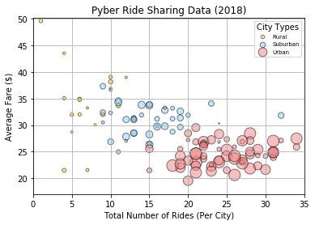
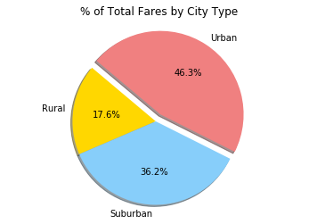
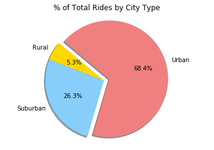
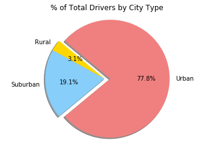

#  Pyber Data Analysis
* From Bubble plot, it shows that the average fare is inversely proportional to the number of rides. For example, average fare in rural places is much higher due to the low number of rides .
* The number of rides taken is proportional to the number of drivers per city. It shows that the city type is a huge factor for the driver preference.
* From the pie chart, the percentage of total fare for 'urban' and 'suburban' is not following the same trend as the 'percentage of total rides and total drivers'. The main reason is the average fare in suburban being higher compensates for lower number of rides compared to 'urban'.


```python
# Importing Dependencies
%matplotlib inline
import matplotlib.pyplot as plt
import pandas as pd
import numpy as np
```


```python
# csv files
city_filename = "raw_data/city_data.csv"
ride_filename = "raw_data/ride_data.csv"

# Reading data from csv files to a dataframe
city_data_df = pd.read_csv(city_filename)
ride_data_df = pd.read_csv(ride_filename)
```


```python
'''
City Data
- Cleaning the data by grouping(city, type) and adding the driver_count 
- Once added, the city-data has unique cities
'''
# Grouping the city-data by 'city' and 'type' 
city_group = city_data_df.groupby(['city', 'type'])

# Adding the drivers count per each (city, type)
city_df = city_group[['driver_count']].sum()
city_df.reset_index(drop=False, inplace=True)
city_df.head()
```


<div>
<style scoped>
    .dataframe tbody tr th:only-of-type {
        vertical-align: middle;
    }

    .dataframe tbody tr th {
        vertical-align: top;
    }

    .dataframe thead th {
        text-align: right;
    }
</style>
<table border="1" class="dataframe">
  <thead>
    <tr style="text-align: right;">
      <th></th>
      <th>city</th>
      <th>type</th>
      <th>driver_count</th>
    </tr>
  </thead>
  <tbody>
    <tr>
      <th>0</th>
      <td>Alvarezhaven</td>
      <td>Urban</td>
      <td>21</td>
    </tr>
    <tr>
      <th>1</th>
      <td>Alyssaberg</td>
      <td>Urban</td>
      <td>67</td>
    </tr>
    <tr>
      <th>2</th>
      <td>Anitamouth</td>
      <td>Suburban</td>
      <td>16</td>
    </tr>
    <tr>
      <th>3</th>
      <td>Antoniomouth</td>
      <td>Urban</td>
      <td>21</td>
    </tr>
    <tr>
      <th>4</th>
      <td>Aprilchester</td>
      <td>Urban</td>
      <td>49</td>
    </tr>
  </tbody>
</table>
</div>


```python
'''
Ride Data
'''
# Grouping the ride-data by city
group_by_city = ride_data_df.groupby(['city'])

# Calculating the 'Average Fare' per city
average_fare_per_city = group_by_city['fare'].mean()

# Calculating 'Total number of rides' per city
rider_count = group_by_city['ride_id'].count()

# Creating a dataframe with the aggregated data (average fare, rider_count) per city
ride_df = pd.DataFrame({'fare': round(average_fare_per_city,2),
                        'rider_count': rider_count})
# Resetting the index 
ride_df.reset_index(drop=False, inplace=True)
ride_df.head()

```


<div>
<style scoped>
    .dataframe tbody tr th:only-of-type {
        vertical-align: middle;
    }

    .dataframe tbody tr th {
        vertical-align: top;
    }

    .dataframe thead th {
        text-align: right;
    }
</style>
<table border="1" class="dataframe">
  <thead>
    <tr style="text-align: right;">
      <th></th>
      <th>city</th>
      <th>fare</th>
      <th>rider_count</th>
    </tr>
  </thead>
  <tbody>
    <tr>
      <th>0</th>
      <td>Alvarezhaven</td>
      <td>23.93</td>
      <td>31</td>
    </tr>
    <tr>
      <th>1</th>
      <td>Alyssaberg</td>
      <td>20.61</td>
      <td>26</td>
    </tr>
    <tr>
      <th>2</th>
      <td>Anitamouth</td>
      <td>37.32</td>
      <td>9</td>
    </tr>
    <tr>
      <th>3</th>
      <td>Antoniomouth</td>
      <td>23.62</td>
      <td>22</td>
    </tr>
    <tr>
      <th>4</th>
      <td>Aprilchester</td>
      <td>21.98</td>
      <td>19</td>
    </tr>
  </tbody>
</table>
</div>


```python
# Merging the city and ride dataframes to get the consolidated 'city-ride' data
city_ride_df = pd.merge(city_df, ride_df, on='city', how='inner')
city_ride_df.head()
```


<div>
<style scoped>
    .dataframe tbody tr th:only-of-type {
        vertical-align: middle;
    }

    .dataframe tbody tr th {
        vertical-align: top;
    }

    .dataframe thead th {
        text-align: right;
    }
</style>
<table border="1" class="dataframe">
  <thead>
    <tr style="text-align: right;">
      <th></th>
      <th>city</th>
      <th>type</th>
      <th>driver_count</th>
      <th>fare</th>
      <th>rider_count</th>
    </tr>
  </thead>
  <tbody>
    <tr>
      <th>0</th>
      <td>Alvarezhaven</td>
      <td>Urban</td>
      <td>21</td>
      <td>23.93</td>
      <td>31</td>
    </tr>
    <tr>
      <th>1</th>
      <td>Alyssaberg</td>
      <td>Urban</td>
      <td>67</td>
      <td>20.61</td>
      <td>26</td>
    </tr>
    <tr>
      <th>2</th>
      <td>Anitamouth</td>
      <td>Suburban</td>
      <td>16</td>
      <td>37.32</td>
      <td>9</td>
    </tr>
    <tr>
      <th>3</th>
      <td>Antoniomouth</td>
      <td>Urban</td>
      <td>21</td>
      <td>23.62</td>
      <td>22</td>
    </tr>
    <tr>
      <th>4</th>
      <td>Aprilchester</td>
      <td>Urban</td>
      <td>49</td>
      <td>21.98</td>
      <td>19</td>
    </tr>
  </tbody>
</table>
</div>


## Bubble Plot of Ride Sharing Data


```python
# Dictionary of colors to assign different colors to legend in the plot
colors = {'Urban': 'lightcoral',
          'Suburban': 'lightskyblue',
          'Rural': 'gold'}

# Calculating the x and y axis limits for the plot 
x_limit_max = round(city_ride_df['rider_count'].max())
y_limit_min = round(city_ride_df['fare'].min())
y_limit_max = round(city_ride_df['fare'].max())

# Grouping the city_ride_data by city_type
groups = city_ride_df.groupby('type')

# Looping through the city_type groups and plotting bubble plot
for index, grp in groups:
    plt.scatter(grp['rider_count'],
                grp['fare'],
                marker ='o',
                facecolors = colors[index],
                edgecolors ='black',
                linewidth = 1,
                # The size of each point on plot is determined by count of drivers per city
                s = grp['driver_count']*3,
                alpha = 0.5,
                label = index)

# Setting x and y limits for the plot axes
plt.xlim(0, (x_limit_max+1))
plt.ylim((y_limit_min-3), (y_limit_max)+0.15)

# Setting title and axis labels 
plt.title('Pyber Ride Sharing Data (2018)')
plt.xlabel('Total Number of Rides (Per City)')
plt.ylabel('Average Fare ($)')

# Adding the title and font-size for legend 
plt.legend(loc='best', title='City Types', fontsize='x-small')

# Adds a grid to the plot
plt.grid()
# Prints the bubble plot to the screen 
plt.show()

```





## % Of Total Fares by City Type


```python
# Total fares by City Type

# Grouping the 'city-ride' data by 'city-type'
groups = city_ride_df.groupby(['type'])

# Calculating the total fare for each city-type
total_fare_bycity = groups['fare'].sum()

# Labels for the sections of pie chart
labels = total_fare_bycity.keys()

# The values of each section of the pie chart
sizes = total_fare_bycity

# The colors of each section of the pie chart
colors = ['gold', 'lightskyblue', 'lightcoral']

# Tells matplotlib to seperate the "Urban" section from the others
explode = (0, 0, 0.1)

# Creates the pie chart based upon the values above
# Automatically finds the percentages of each part of the pie chart
plt.pie(sizes, explode=explode, labels=labels, colors=colors,
        autopct="%1.1f%%", shadow=True, startangle=140)

# Setting title for the pie chart
plt.title('% of Total Fares by City Type')

# Tells matplotlib that we want a pie chart with equal axes
plt.axis("equal")

# Prints pie chart to the screen
plt.show()
```





## % Of Total Rides by City Type


```python
# Total rides by City Type

# Grouping the 'city-ride' data by 'city-type'
groups = city_ride_df.groupby(['type'])

# Calculating the total number of rides for each city-type
total_rides_bycity = groups['rider_count'].sum()

# Labels for the sections of pie chart
labels = total_rides_bycity.keys()

# The values of each section of the pie chart
sizes = total_rides_bycity

# The colors of each section of the pie chart
colors = ['gold', 'lightskyblue', 'lightcoral']

# Tells matplotlib to seperate the "Urban" section from the others
explode = (0, 0, 0.1)

# Creates the pie chart based upon the values above
# Automatically finds the percentages of each part of the pie chart
plt.pie(sizes, explode=explode, labels=labels, colors=colors,
        autopct="%1.1f%%", shadow=True, startangle=140)

# Setting title for the pie chart
plt.title('% of Total Rides by City Type')

# Tells matplotlib that we want a pie chart with equal axes
plt.axis("equal")

# Prints pie chart to the screen
plt.show()
```





## % Of Total Drivers by City Type


```python
# Total Drivers by City Type

# Grouping the 'city-ride' data by 'city-type'
groups = city_ride_df.groupby(['type'])

# Calculating the total count of drivers for each city-type
total_divers_bycity = groups['driver_count'].sum()

# Labels for the sections of pie chart
labels = total_divers_bycity.keys()

# The values of each section of the pie chart
sizes = total_divers_bycity

# The colors of each section of the pie chart
colors = ['gold', 'lightskyblue', 'lightcoral']

# Tells matplotlib to seperate the "Urban" section from the others
explode = (0, 0, 0.1)

# Creates the pie chart based upon the values above
# Automatically finds the percentages of each part of the pie chart
plt.pie(sizes, explode=explode, labels=labels, colors=colors,
        autopct="%1.1f%%", shadow=True, startangle=140)

# Setting title for the pie chart
plt.title('% of Total Drivers by City Type')
          
# Tells matplotlib that we want a pie chart with equal axes
plt.axis("equal")

# Prints our pie chart to the screen
plt.show()
```




