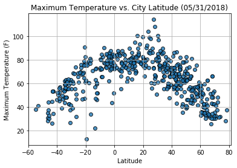
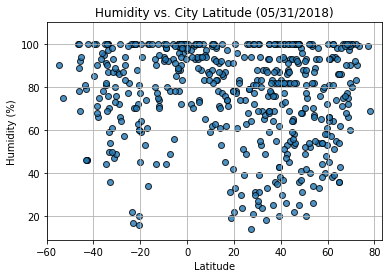
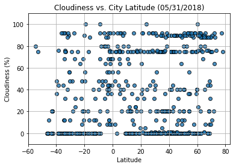
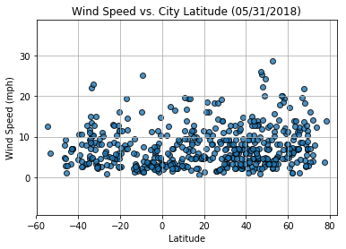

#  WeatherPy Data Analysis
* From Max.Temperature versus Latitude Scatter plot, the maximum temperature is in the latitude range(-20 to 20), which infers cities closer to the equator are hotter.
* From Wind speed versus Latitude Scatter plot, the average wind speed is around 10(mph)
* From Humidity versus Latitude Scatter Plot, on an average, more number of cities have high humidity that are far away from the equator.

### Importing all dependencies


```python
%matplotlib inline
import pandas as pd
import numpy as np
import random
import requests
import matplotlib.pyplot as plt
from citipy import citipy
from config import api_key 
```

Importing the Python Library citipy, to generate cities 

## Generating Cities List  and Performing Weather API calls

Generate random co-ordinates(latitude, longitude) between latitude range (-90,90) and longitude range(-180, 180).
Using the citypy library, find the nearest city with the generated co-ordinates.
Next check if city is unique, then make an API call to the weather API, and if weather data exists with for the city, then
add the city to the city list. 
Check for the exceptions if city name is not found and handle accordingly to skip the city and continue checking for the
next city until the city limit reaches to 500.


```python
url = "http://api.openweathermap.org/data/2.5/weather?"
params = {
    "appid": api_key,
    "units": "imperial"
}
weather_data = []
cities = set()

print("Beginning Data Retrieval")
print("-"*25)
city_number = len(cities)

while (len(cities) < 500):
    lat = random.uniform(-90,90)
    lng = random.uniform(-180,180)
   
    city = citipy.nearest_city(lat,lng)
 
    try:
        if city.city_name not in cities:
            params["q"] = city.city_name
            response = requests.get(url, params)
            
            print(f"Processing Record {city_number}| {city.city_name}")
            print(response.url)
    
            data =  response.json()
            if (response.status_code == requests.codes.ok):
                weather_data.append(data)
                cities.add(city.city_name) 
            else:
                print("city data not found..skipping..") 
        city_number += 1
    except Exception as e:
        print(f"Caught exception {e} for response {response.url}")
        continue

print("-"*25)        
print("Data Retrieval complete")
print("-"*25)        
```

    Beginning Data Retrieval
    -------------------------
    Processing Record 0| beringovskiy
    http://api.openweathermap.org/data/2.5/weather?appid=e64ebe0129d34a5728cb3fa58e64ab13&units=imperial&q=beringovskiy
    Processing Record 1| provideniya
    http://api.openweathermap.org/data/2.5/weather?appid=e64ebe0129d34a5728cb3fa58e64ab13&units=imperial&q=provideniya
    Processing Record 2| arraial do cabo
    http://api.openweathermap.org/data/2.5/weather?appid=e64ebe0129d34a5728cb3fa58e64ab13&units=imperial&q=arraial+do+cabo
    Processing Record 3| asau
    http://api.openweathermap.org/data/2.5/weather?appid=e64ebe0129d34a5728cb3fa58e64ab13&units=imperial&q=asau
    city data not found..skipping..
    Processing Record 4| puerto ayora
    http://api.openweathermap.org/data/2.5/weather?appid=e64ebe0129d34a5728cb3fa58e64ab13&units=imperial&q=puerto+ayora
    Processing Record 5| waycross
    http://api.openweathermap.org/data/2.5/weather?appid=e64ebe0129d34a5728cb3fa58e64ab13&units=imperial&q=waycross
    Processing Record 6| manjeshwar
    http://api.openweathermap.org/data/2.5/weather?appid=e64ebe0129d34a5728cb3fa58e64ab13&units=imperial&q=manjeshwar
    Processing Record 7| kaitangata
    http://api.openweathermap.org/data/2.5/weather?appid=e64ebe0129d34a5728cb3fa58e64ab13&units=imperial&q=kaitangata
    Processing Record 8| general pico
    http://api.openweathermap.org/data/2.5/weather?appid=e64ebe0129d34a5728cb3fa58e64ab13&units=imperial&q=general+pico
    Processing Record 9| tasiilaq
    http://api.openweathermap.org/data/2.5/weather?appid=e64ebe0129d34a5728cb3fa58e64ab13&units=imperial&q=tasiilaq
    Processing Record 10| georgetown
    http://api.openweathermap.org/data/2.5/weather?appid=e64ebe0129d34a5728cb3fa58e64ab13&units=imperial&q=georgetown
    Processing Record 11| ushuaia
    http://api.openweathermap.org/data/2.5/weather?appid=e64ebe0129d34a5728cb3fa58e64ab13&units=imperial&q=ushuaia
    Processing Record 12| bredasdorp
    http://api.openweathermap.org/data/2.5/weather?appid=e64ebe0129d34a5728cb3fa58e64ab13&units=imperial&q=bredasdorp
    Processing Record 13| vaini
    http://api.openweathermap.org/data/2.5/weather?appid=e64ebe0129d34a5728cb3fa58e64ab13&units=imperial&q=vaini
    Processing Record 14| karakendzha
    http://api.openweathermap.org/data/2.5/weather?appid=e64ebe0129d34a5728cb3fa58e64ab13&units=imperial&q=karakendzha
    city data not found..skipping..
    Processing Record 15| sentyabrskiy
    http://api.openweathermap.org/data/2.5/weather?appid=e64ebe0129d34a5728cb3fa58e64ab13&units=imperial&q=sentyabrskiy
    city data not found..skipping..
    Processing Record 16| belushya guba
    http://api.openweathermap.org/data/2.5/weather?appid=e64ebe0129d34a5728cb3fa58e64ab13&units=imperial&q=belushya+guba
    city data not found..skipping..
    Processing Record 17| gizo
    http://api.openweathermap.org/data/2.5/weather?appid=e64ebe0129d34a5728cb3fa58e64ab13&units=imperial&q=gizo
    Processing Record 18| rikitea
    http://api.openweathermap.org/data/2.5/weather?appid=e64ebe0129d34a5728cb3fa58e64ab13&units=imperial&q=rikitea
    Processing Record 20| busselton
    http://api.openweathermap.org/data/2.5/weather?appid=e64ebe0129d34a5728cb3fa58e64ab13&units=imperial&q=busselton
    Processing Record 21| new norfolk
    http://api.openweathermap.org/data/2.5/weather?appid=e64ebe0129d34a5728cb3fa58e64ab13&units=imperial&q=new+norfolk
    Processing Record 22| mataura
    http://api.openweathermap.org/data/2.5/weather?appid=e64ebe0129d34a5728cb3fa58e64ab13&units=imperial&q=mataura
    Processing Record 23| potosi
    http://api.openweathermap.org/data/2.5/weather?appid=e64ebe0129d34a5728cb3fa58e64ab13&units=imperial&q=potosi
    Processing Record 24| hilo
    http://api.openweathermap.org/data/2.5/weather?appid=e64ebe0129d34a5728cb3fa58e64ab13&units=imperial&q=hilo
    Processing Record 25| atar
    http://api.openweathermap.org/data/2.5/weather?appid=e64ebe0129d34a5728cb3fa58e64ab13&units=imperial&q=atar
    Processing Record 26| port lincoln
    http://api.openweathermap.org/data/2.5/weather?appid=e64ebe0129d34a5728cb3fa58e64ab13&units=imperial&q=port+lincoln
    Processing Record 27| itarema
    http://api.openweathermap.org/data/2.5/weather?appid=e64ebe0129d34a5728cb3fa58e64ab13&units=imperial&q=itarema
    Processing Record 28| port elizabeth
    http://api.openweathermap.org/data/2.5/weather?appid=e64ebe0129d34a5728cb3fa58e64ab13&units=imperial&q=port+elizabeth
    Processing Record 29| kokoda
    http://api.openweathermap.org/data/2.5/weather?appid=e64ebe0129d34a5728cb3fa58e64ab13&units=imperial&q=kokoda
    Processing Record 30| albany
    http://api.openweathermap.org/data/2.5/weather?appid=e64ebe0129d34a5728cb3fa58e64ab13&units=imperial&q=albany
    Processing Record 31| illoqqortoormiut
    http://api.openweathermap.org/data/2.5/weather?appid=e64ebe0129d34a5728cb3fa58e64ab13&units=imperial&q=illoqqortoormiut
    city data not found..skipping..
    Processing Record 32| marawi
    http://api.openweathermap.org/data/2.5/weather?appid=e64ebe0129d34a5728cb3fa58e64ab13&units=imperial&q=marawi
    Processing Record 34| durban
    http://api.openweathermap.org/data/2.5/weather?appid=e64ebe0129d34a5728cb3fa58e64ab13&units=imperial&q=durban
    Processing Record 35| harper
    http://api.openweathermap.org/data/2.5/weather?appid=e64ebe0129d34a5728cb3fa58e64ab13&units=imperial&q=harper
    Processing Record 38| khorramshahr
    http://api.openweathermap.org/data/2.5/weather?appid=e64ebe0129d34a5728cb3fa58e64ab13&units=imperial&q=khorramshahr
    Processing Record 39| springdale
    http://api.openweathermap.org/data/2.5/weather?appid=e64ebe0129d34a5728cb3fa58e64ab13&units=imperial&q=springdale
    Processing Record 40| taolanaro
    http://api.openweathermap.org/data/2.5/weather?appid=e64ebe0129d34a5728cb3fa58e64ab13&units=imperial&q=taolanaro
    city data not found..skipping..
    Processing Record 41| santiago
    http://api.openweathermap.org/data/2.5/weather?appid=e64ebe0129d34a5728cb3fa58e64ab13&units=imperial&q=santiago
    Processing Record 42| saint george
    http://api.openweathermap.org/data/2.5/weather?appid=e64ebe0129d34a5728cb3fa58e64ab13&units=imperial&q=saint+george
    Processing Record 43| tortoli
    http://api.openweathermap.org/data/2.5/weather?appid=e64ebe0129d34a5728cb3fa58e64ab13&units=imperial&q=tortoli
    Processing Record 44| karauzyak
    http://api.openweathermap.org/data/2.5/weather?appid=e64ebe0129d34a5728cb3fa58e64ab13&units=imperial&q=karauzyak
    city data not found..skipping..
    Processing Record 45| saskylakh
    http://api.openweathermap.org/data/2.5/weather?appid=e64ebe0129d34a5728cb3fa58e64ab13&units=imperial&q=saskylakh
    Processing Record 46| bethel
    http://api.openweathermap.org/data/2.5/weather?appid=e64ebe0129d34a5728cb3fa58e64ab13&units=imperial&q=bethel
    Processing Record 48| hamilton
    http://api.openweathermap.org/data/2.5/weather?appid=e64ebe0129d34a5728cb3fa58e64ab13&units=imperial&q=hamilton
    Processing Record 49| zhengjiatun
    http://api.openweathermap.org/data/2.5/weather?appid=e64ebe0129d34a5728cb3fa58e64ab13&units=imperial&q=zhengjiatun
    Processing Record 50| ponta do sol
    http://api.openweathermap.org/data/2.5/weather?appid=e64ebe0129d34a5728cb3fa58e64ab13&units=imperial&q=ponta+do+sol
    Processing Record 52| tuktoyaktuk
    http://api.openweathermap.org/data/2.5/weather?appid=e64ebe0129d34a5728cb3fa58e64ab13&units=imperial&q=tuktoyaktuk
    Processing Record 54| himensulan
    http://api.openweathermap.org/data/2.5/weather?appid=e64ebe0129d34a5728cb3fa58e64ab13&units=imperial&q=himensulan
    Processing Record 55| punta arenas
    http://api.openweathermap.org/data/2.5/weather?appid=e64ebe0129d34a5728cb3fa58e64ab13&units=imperial&q=punta+arenas
    Processing Record 56| port pirie
    http://api.openweathermap.org/data/2.5/weather?appid=e64ebe0129d34a5728cb3fa58e64ab13&units=imperial&q=port+pirie
    Processing Record 59| taolanaro
    http://api.openweathermap.org/data/2.5/weather?appid=e64ebe0129d34a5728cb3fa58e64ab13&units=imperial&q=taolanaro
    city data not found..skipping..
    Processing Record 61| talcahuano
    http://api.openweathermap.org/data/2.5/weather?appid=e64ebe0129d34a5728cb3fa58e64ab13&units=imperial&q=talcahuano
    Processing Record 62| coquimbo
    http://api.openweathermap.org/data/2.5/weather?appid=e64ebe0129d34a5728cb3fa58e64ab13&units=imperial&q=coquimbo
    Processing Record 64| leningradskiy
    http://api.openweathermap.org/data/2.5/weather?appid=e64ebe0129d34a5728cb3fa58e64ab13&units=imperial&q=leningradskiy
    Processing Record 65| oussouye
    http://api.openweathermap.org/data/2.5/weather?appid=e64ebe0129d34a5728cb3fa58e64ab13&units=imperial&q=oussouye
    Processing Record 67| nikolskoye
    http://api.openweathermap.org/data/2.5/weather?appid=e64ebe0129d34a5728cb3fa58e64ab13&units=imperial&q=nikolskoye
    Processing Record 68| chuy
    http://api.openweathermap.org/data/2.5/weather?appid=e64ebe0129d34a5728cb3fa58e64ab13&units=imperial&q=chuy
    Processing Record 69| dikson
    http://api.openweathermap.org/data/2.5/weather?appid=e64ebe0129d34a5728cb3fa58e64ab13&units=imperial&q=dikson
    Processing Record 70| port alfred
    http://api.openweathermap.org/data/2.5/weather?appid=e64ebe0129d34a5728cb3fa58e64ab13&units=imperial&q=port+alfred
    Processing Record 73| cape town
    http://api.openweathermap.org/data/2.5/weather?appid=e64ebe0129d34a5728cb3fa58e64ab13&units=imperial&q=cape+town
    Processing Record 74| kodiak
    http://api.openweathermap.org/data/2.5/weather?appid=e64ebe0129d34a5728cb3fa58e64ab13&units=imperial&q=kodiak
    Processing Record 76| batemans bay
    http://api.openweathermap.org/data/2.5/weather?appid=e64ebe0129d34a5728cb3fa58e64ab13&units=imperial&q=batemans+bay
    Processing Record 77| vila velha
    http://api.openweathermap.org/data/2.5/weather?appid=e64ebe0129d34a5728cb3fa58e64ab13&units=imperial&q=vila+velha
    Processing Record 78| yellowknife
    http://api.openweathermap.org/data/2.5/weather?appid=e64ebe0129d34a5728cb3fa58e64ab13&units=imperial&q=yellowknife
    Processing Record 79| lompoc
    http://api.openweathermap.org/data/2.5/weather?appid=e64ebe0129d34a5728cb3fa58e64ab13&units=imperial&q=lompoc
    Processing Record 80| victoria
    http://api.openweathermap.org/data/2.5/weather?appid=e64ebe0129d34a5728cb3fa58e64ab13&units=imperial&q=victoria
    Processing Record 81| hithadhoo
    http://api.openweathermap.org/data/2.5/weather?appid=e64ebe0129d34a5728cb3fa58e64ab13&units=imperial&q=hithadhoo
    Processing Record 84| bluff
    http://api.openweathermap.org/data/2.5/weather?appid=e64ebe0129d34a5728cb3fa58e64ab13&units=imperial&q=bluff
    Processing Record 85| aguas de lindoia
    http://api.openweathermap.org/data/2.5/weather?appid=e64ebe0129d34a5728cb3fa58e64ab13&units=imperial&q=aguas+de+lindoia
    Processing Record 86| upernavik
    http://api.openweathermap.org/data/2.5/weather?appid=e64ebe0129d34a5728cb3fa58e64ab13&units=imperial&q=upernavik
    Processing Record 87| la asuncion
    http://api.openweathermap.org/data/2.5/weather?appid=e64ebe0129d34a5728cb3fa58e64ab13&units=imperial&q=la+asuncion
    Processing Record 88| lebu
    http://api.openweathermap.org/data/2.5/weather?appid=e64ebe0129d34a5728cb3fa58e64ab13&units=imperial&q=lebu
    Processing Record 89| la ronge
    http://api.openweathermap.org/data/2.5/weather?appid=e64ebe0129d34a5728cb3fa58e64ab13&units=imperial&q=la+ronge
    Processing Record 90| evensk
    http://api.openweathermap.org/data/2.5/weather?appid=e64ebe0129d34a5728cb3fa58e64ab13&units=imperial&q=evensk
    Processing Record 92| taolanaro
    http://api.openweathermap.org/data/2.5/weather?appid=e64ebe0129d34a5728cb3fa58e64ab13&units=imperial&q=taolanaro
    city data not found..skipping..
    Processing Record 93| khatanga
    http://api.openweathermap.org/data/2.5/weather?appid=e64ebe0129d34a5728cb3fa58e64ab13&units=imperial&q=khatanga
    Processing Record 95| homer
    http://api.openweathermap.org/data/2.5/weather?appid=e64ebe0129d34a5728cb3fa58e64ab13&units=imperial&q=homer
    Processing Record 96| sao borja
    http://api.openweathermap.org/data/2.5/weather?appid=e64ebe0129d34a5728cb3fa58e64ab13&units=imperial&q=sao+borja
    Processing Record 97| butaritari
    http://api.openweathermap.org/data/2.5/weather?appid=e64ebe0129d34a5728cb3fa58e64ab13&units=imperial&q=butaritari
    Processing Record 98| illoqqortoormiut
    http://api.openweathermap.org/data/2.5/weather?appid=e64ebe0129d34a5728cb3fa58e64ab13&units=imperial&q=illoqqortoormiut
    city data not found..skipping..
    Processing Record 99| hyeres
    http://api.openweathermap.org/data/2.5/weather?appid=e64ebe0129d34a5728cb3fa58e64ab13&units=imperial&q=hyeres
    Processing Record 100| jalu
    http://api.openweathermap.org/data/2.5/weather?appid=e64ebe0129d34a5728cb3fa58e64ab13&units=imperial&q=jalu
    Processing Record 101| hihifo
    http://api.openweathermap.org/data/2.5/weather?appid=e64ebe0129d34a5728cb3fa58e64ab13&units=imperial&q=hihifo
    city data not found..skipping..
    Processing Record 102| baraya
    http://api.openweathermap.org/data/2.5/weather?appid=e64ebe0129d34a5728cb3fa58e64ab13&units=imperial&q=baraya
    Processing Record 103| tabiauea
    http://api.openweathermap.org/data/2.5/weather?appid=e64ebe0129d34a5728cb3fa58e64ab13&units=imperial&q=tabiauea
    city data not found..skipping..
    Processing Record 104| vao
    http://api.openweathermap.org/data/2.5/weather?appid=e64ebe0129d34a5728cb3fa58e64ab13&units=imperial&q=vao
    Processing Record 105| santa lucia
    http://api.openweathermap.org/data/2.5/weather?appid=e64ebe0129d34a5728cb3fa58e64ab13&units=imperial&q=santa+lucia
    Processing Record 106| sao joao da barra
    http://api.openweathermap.org/data/2.5/weather?appid=e64ebe0129d34a5728cb3fa58e64ab13&units=imperial&q=sao+joao+da+barra
    Processing Record 108| obihiro
    http://api.openweathermap.org/data/2.5/weather?appid=e64ebe0129d34a5728cb3fa58e64ab13&units=imperial&q=obihiro
    Processing Record 109| paragominas
    http://api.openweathermap.org/data/2.5/weather?appid=e64ebe0129d34a5728cb3fa58e64ab13&units=imperial&q=paragominas
    Processing Record 111| armacao dos buzios
    http://api.openweathermap.org/data/2.5/weather?appid=e64ebe0129d34a5728cb3fa58e64ab13&units=imperial&q=armacao+dos+buzios
    city data not found..skipping..
    Processing Record 112| kahului
    http://api.openweathermap.org/data/2.5/weather?appid=e64ebe0129d34a5728cb3fa58e64ab13&units=imperial&q=kahului
    Processing Record 113| samalaeulu
    http://api.openweathermap.org/data/2.5/weather?appid=e64ebe0129d34a5728cb3fa58e64ab13&units=imperial&q=samalaeulu
    city data not found..skipping..
    Processing Record 114| oranjestad
    http://api.openweathermap.org/data/2.5/weather?appid=e64ebe0129d34a5728cb3fa58e64ab13&units=imperial&q=oranjestad
    Processing Record 115| luderitz
    http://api.openweathermap.org/data/2.5/weather?appid=e64ebe0129d34a5728cb3fa58e64ab13&units=imperial&q=luderitz
    Processing Record 118| fortuna
    http://api.openweathermap.org/data/2.5/weather?appid=e64ebe0129d34a5728cb3fa58e64ab13&units=imperial&q=fortuna
    Processing Record 121| taolanaro
    http://api.openweathermap.org/data/2.5/weather?appid=e64ebe0129d34a5728cb3fa58e64ab13&units=imperial&q=taolanaro
    city data not found..skipping..
    Processing Record 123| aksarka
    http://api.openweathermap.org/data/2.5/weather?appid=e64ebe0129d34a5728cb3fa58e64ab13&units=imperial&q=aksarka
    Processing Record 124| hambantota
    http://api.openweathermap.org/data/2.5/weather?appid=e64ebe0129d34a5728cb3fa58e64ab13&units=imperial&q=hambantota
    Processing Record 126| tiksi
    http://api.openweathermap.org/data/2.5/weather?appid=e64ebe0129d34a5728cb3fa58e64ab13&units=imperial&q=tiksi
    Processing Record 127| kungurtug
    http://api.openweathermap.org/data/2.5/weather?appid=e64ebe0129d34a5728cb3fa58e64ab13&units=imperial&q=kungurtug
    Processing Record 128| shubarkuduk
    http://api.openweathermap.org/data/2.5/weather?appid=e64ebe0129d34a5728cb3fa58e64ab13&units=imperial&q=shubarkuduk
    Processing Record 129| shimoda
    http://api.openweathermap.org/data/2.5/weather?appid=e64ebe0129d34a5728cb3fa58e64ab13&units=imperial&q=shimoda
    Processing Record 130| port hardy
    http://api.openweathermap.org/data/2.5/weather?appid=e64ebe0129d34a5728cb3fa58e64ab13&units=imperial&q=port+hardy
    Processing Record 133| lucapa
    http://api.openweathermap.org/data/2.5/weather?appid=e64ebe0129d34a5728cb3fa58e64ab13&units=imperial&q=lucapa
    Processing Record 134| amderma
    http://api.openweathermap.org/data/2.5/weather?appid=e64ebe0129d34a5728cb3fa58e64ab13&units=imperial&q=amderma
    city data not found..skipping..
    Processing Record 135| lander
    http://api.openweathermap.org/data/2.5/weather?appid=e64ebe0129d34a5728cb3fa58e64ab13&units=imperial&q=lander
    Processing Record 136| thompson
    http://api.openweathermap.org/data/2.5/weather?appid=e64ebe0129d34a5728cb3fa58e64ab13&units=imperial&q=thompson
    Processing Record 137| barentsburg
    http://api.openweathermap.org/data/2.5/weather?appid=e64ebe0129d34a5728cb3fa58e64ab13&units=imperial&q=barentsburg
    city data not found..skipping..
    Processing Record 139| atuona
    http://api.openweathermap.org/data/2.5/weather?appid=e64ebe0129d34a5728cb3fa58e64ab13&units=imperial&q=atuona
    Processing Record 141| puerto del rosario
    http://api.openweathermap.org/data/2.5/weather?appid=e64ebe0129d34a5728cb3fa58e64ab13&units=imperial&q=puerto+del+rosario
    Processing Record 142| castro
    http://api.openweathermap.org/data/2.5/weather?appid=e64ebe0129d34a5728cb3fa58e64ab13&units=imperial&q=castro
    Processing Record 144| bowmore
    http://api.openweathermap.org/data/2.5/weather?appid=e64ebe0129d34a5728cb3fa58e64ab13&units=imperial&q=bowmore
    Processing Record 146| geraldton
    http://api.openweathermap.org/data/2.5/weather?appid=e64ebe0129d34a5728cb3fa58e64ab13&units=imperial&q=geraldton
    Processing Record 147| lisakovsk
    http://api.openweathermap.org/data/2.5/weather?appid=e64ebe0129d34a5728cb3fa58e64ab13&units=imperial&q=lisakovsk
    Processing Record 149| grindavik
    http://api.openweathermap.org/data/2.5/weather?appid=e64ebe0129d34a5728cb3fa58e64ab13&units=imperial&q=grindavik
    Processing Record 150| belushya guba
    http://api.openweathermap.org/data/2.5/weather?appid=e64ebe0129d34a5728cb3fa58e64ab13&units=imperial&q=belushya+guba
    city data not found..skipping..
    Processing Record 152| east london
    http://api.openweathermap.org/data/2.5/weather?appid=e64ebe0129d34a5728cb3fa58e64ab13&units=imperial&q=east+london
    Processing Record 153| port hedland
    http://api.openweathermap.org/data/2.5/weather?appid=e64ebe0129d34a5728cb3fa58e64ab13&units=imperial&q=port+hedland
    Processing Record 154| utiroa
    http://api.openweathermap.org/data/2.5/weather?appid=e64ebe0129d34a5728cb3fa58e64ab13&units=imperial&q=utiroa
    city data not found..skipping..
    Processing Record 155| takoradi
    http://api.openweathermap.org/data/2.5/weather?appid=e64ebe0129d34a5728cb3fa58e64ab13&units=imperial&q=takoradi
    Processing Record 156| bathsheba
    http://api.openweathermap.org/data/2.5/weather?appid=e64ebe0129d34a5728cb3fa58e64ab13&units=imperial&q=bathsheba
    Processing Record 157| soyo
    http://api.openweathermap.org/data/2.5/weather?appid=e64ebe0129d34a5728cb3fa58e64ab13&units=imperial&q=soyo
    Processing Record 158| burns lake
    http://api.openweathermap.org/data/2.5/weather?appid=e64ebe0129d34a5728cb3fa58e64ab13&units=imperial&q=burns+lake
    Processing Record 159| duku
    http://api.openweathermap.org/data/2.5/weather?appid=e64ebe0129d34a5728cb3fa58e64ab13&units=imperial&q=duku
    Processing Record 160| sitka
    http://api.openweathermap.org/data/2.5/weather?appid=e64ebe0129d34a5728cb3fa58e64ab13&units=imperial&q=sitka
    Processing Record 161| wulanhaote
    http://api.openweathermap.org/data/2.5/weather?appid=e64ebe0129d34a5728cb3fa58e64ab13&units=imperial&q=wulanhaote
    city data not found..skipping..
    Processing Record 163| attawapiskat
    http://api.openweathermap.org/data/2.5/weather?appid=e64ebe0129d34a5728cb3fa58e64ab13&units=imperial&q=attawapiskat
    city data not found..skipping..
    Processing Record 164| qaanaaq
    http://api.openweathermap.org/data/2.5/weather?appid=e64ebe0129d34a5728cb3fa58e64ab13&units=imperial&q=qaanaaq
    Processing Record 165| peniche
    http://api.openweathermap.org/data/2.5/weather?appid=e64ebe0129d34a5728cb3fa58e64ab13&units=imperial&q=peniche
    Processing Record 166| saint-philippe
    http://api.openweathermap.org/data/2.5/weather?appid=e64ebe0129d34a5728cb3fa58e64ab13&units=imperial&q=saint-philippe
    Processing Record 168| mandalgovi
    http://api.openweathermap.org/data/2.5/weather?appid=e64ebe0129d34a5728cb3fa58e64ab13&units=imperial&q=mandalgovi
    Processing Record 169| kawalu
    http://api.openweathermap.org/data/2.5/weather?appid=e64ebe0129d34a5728cb3fa58e64ab13&units=imperial&q=kawalu
    Processing Record 172| comodoro rivadavia
    http://api.openweathermap.org/data/2.5/weather?appid=e64ebe0129d34a5728cb3fa58e64ab13&units=imperial&q=comodoro+rivadavia
    Processing Record 173| kaspiyskiy
    http://api.openweathermap.org/data/2.5/weather?appid=e64ebe0129d34a5728cb3fa58e64ab13&units=imperial&q=kaspiyskiy
    Processing Record 174| kapaa
    http://api.openweathermap.org/data/2.5/weather?appid=e64ebe0129d34a5728cb3fa58e64ab13&units=imperial&q=kapaa
    Processing Record 176| cartagena
    http://api.openweathermap.org/data/2.5/weather?appid=e64ebe0129d34a5728cb3fa58e64ab13&units=imperial&q=cartagena
    Processing Record 177| ribeira grande
    http://api.openweathermap.org/data/2.5/weather?appid=e64ebe0129d34a5728cb3fa58e64ab13&units=imperial&q=ribeira+grande
    Processing Record 181| havre-saint-pierre
    http://api.openweathermap.org/data/2.5/weather?appid=e64ebe0129d34a5728cb3fa58e64ab13&units=imperial&q=havre-saint-pierre
    Processing Record 183| mahebourg
    http://api.openweathermap.org/data/2.5/weather?appid=e64ebe0129d34a5728cb3fa58e64ab13&units=imperial&q=mahebourg
    Processing Record 184| mount isa
    http://api.openweathermap.org/data/2.5/weather?appid=e64ebe0129d34a5728cb3fa58e64ab13&units=imperial&q=mount+isa
    Processing Record 185| chokurdakh
    http://api.openweathermap.org/data/2.5/weather?appid=e64ebe0129d34a5728cb3fa58e64ab13&units=imperial&q=chokurdakh
    Processing Record 188| cherskiy
    http://api.openweathermap.org/data/2.5/weather?appid=e64ebe0129d34a5728cb3fa58e64ab13&units=imperial&q=cherskiy
    Processing Record 189| shitanjing
    http://api.openweathermap.org/data/2.5/weather?appid=e64ebe0129d34a5728cb3fa58e64ab13&units=imperial&q=shitanjing
    Processing Record 190| carutapera
    http://api.openweathermap.org/data/2.5/weather?appid=e64ebe0129d34a5728cb3fa58e64ab13&units=imperial&q=carutapera
    Processing Record 191| rundu
    http://api.openweathermap.org/data/2.5/weather?appid=e64ebe0129d34a5728cb3fa58e64ab13&units=imperial&q=rundu
    Processing Record 194| belaya gora
    http://api.openweathermap.org/data/2.5/weather?appid=e64ebe0129d34a5728cb3fa58e64ab13&units=imperial&q=belaya+gora
    Processing Record 195| killybegs
    http://api.openweathermap.org/data/2.5/weather?appid=e64ebe0129d34a5728cb3fa58e64ab13&units=imperial&q=killybegs
    Processing Record 196| mar del plata
    http://api.openweathermap.org/data/2.5/weather?appid=e64ebe0129d34a5728cb3fa58e64ab13&units=imperial&q=mar+del+plata
    Processing Record 198| suoyarvi
    http://api.openweathermap.org/data/2.5/weather?appid=e64ebe0129d34a5728cb3fa58e64ab13&units=imperial&q=suoyarvi
    Processing Record 200| nantucket
    http://api.openweathermap.org/data/2.5/weather?appid=e64ebe0129d34a5728cb3fa58e64ab13&units=imperial&q=nantucket
    Processing Record 202| bambous virieux
    http://api.openweathermap.org/data/2.5/weather?appid=e64ebe0129d34a5728cb3fa58e64ab13&units=imperial&q=bambous+virieux
    Processing Record 203| dali
    http://api.openweathermap.org/data/2.5/weather?appid=e64ebe0129d34a5728cb3fa58e64ab13&units=imperial&q=dali
    Processing Record 204| isangel
    http://api.openweathermap.org/data/2.5/weather?appid=e64ebe0129d34a5728cb3fa58e64ab13&units=imperial&q=isangel
    Processing Record 205| belushya guba
    http://api.openweathermap.org/data/2.5/weather?appid=e64ebe0129d34a5728cb3fa58e64ab13&units=imperial&q=belushya+guba
    city data not found..skipping..
    Processing Record 206| clyde river
    http://api.openweathermap.org/data/2.5/weather?appid=e64ebe0129d34a5728cb3fa58e64ab13&units=imperial&q=clyde+river
    Processing Record 207| drayton valley
    http://api.openweathermap.org/data/2.5/weather?appid=e64ebe0129d34a5728cb3fa58e64ab13&units=imperial&q=drayton+valley
    Processing Record 208| oudtshoorn
    http://api.openweathermap.org/data/2.5/weather?appid=e64ebe0129d34a5728cb3fa58e64ab13&units=imperial&q=oudtshoorn
    Processing Record 209| barrow
    http://api.openweathermap.org/data/2.5/weather?appid=e64ebe0129d34a5728cb3fa58e64ab13&units=imperial&q=barrow
    Processing Record 210| hofn
    http://api.openweathermap.org/data/2.5/weather?appid=e64ebe0129d34a5728cb3fa58e64ab13&units=imperial&q=hofn
    Processing Record 211| pedernales
    http://api.openweathermap.org/data/2.5/weather?appid=e64ebe0129d34a5728cb3fa58e64ab13&units=imperial&q=pedernales
    Processing Record 212| hermanus
    http://api.openweathermap.org/data/2.5/weather?appid=e64ebe0129d34a5728cb3fa58e64ab13&units=imperial&q=hermanus
    Processing Record 213| portland
    http://api.openweathermap.org/data/2.5/weather?appid=e64ebe0129d34a5728cb3fa58e64ab13&units=imperial&q=portland
    Processing Record 215| sentyabrskiy
    http://api.openweathermap.org/data/2.5/weather?appid=e64ebe0129d34a5728cb3fa58e64ab13&units=imperial&q=sentyabrskiy
    city data not found..skipping..
    Processing Record 216| beloha
    http://api.openweathermap.org/data/2.5/weather?appid=e64ebe0129d34a5728cb3fa58e64ab13&units=imperial&q=beloha
    Processing Record 217| prince rupert
    http://api.openweathermap.org/data/2.5/weather?appid=e64ebe0129d34a5728cb3fa58e64ab13&units=imperial&q=prince+rupert
    Processing Record 218| mont-de-marsan
    http://api.openweathermap.org/data/2.5/weather?appid=e64ebe0129d34a5728cb3fa58e64ab13&units=imperial&q=mont-de-marsan
    Processing Record 221| znamenskoye
    http://api.openweathermap.org/data/2.5/weather?appid=e64ebe0129d34a5728cb3fa58e64ab13&units=imperial&q=znamenskoye
    Processing Record 222| vaitupu
    http://api.openweathermap.org/data/2.5/weather?appid=e64ebe0129d34a5728cb3fa58e64ab13&units=imperial&q=vaitupu
    city data not found..skipping..
    Processing Record 223| wulanhaote
    http://api.openweathermap.org/data/2.5/weather?appid=e64ebe0129d34a5728cb3fa58e64ab13&units=imperial&q=wulanhaote
    city data not found..skipping..
    Processing Record 224| plesetsk
    http://api.openweathermap.org/data/2.5/weather?appid=e64ebe0129d34a5728cb3fa58e64ab13&units=imperial&q=plesetsk
    Processing Record 227| illoqqortoormiut
    http://api.openweathermap.org/data/2.5/weather?appid=e64ebe0129d34a5728cb3fa58e64ab13&units=imperial&q=illoqqortoormiut
    city data not found..skipping..
    Processing Record 229| broken hill
    http://api.openweathermap.org/data/2.5/weather?appid=e64ebe0129d34a5728cb3fa58e64ab13&units=imperial&q=broken+hill
    Processing Record 230| rocha
    http://api.openweathermap.org/data/2.5/weather?appid=e64ebe0129d34a5728cb3fa58e64ab13&units=imperial&q=rocha
    Processing Record 236| coihaique
    http://api.openweathermap.org/data/2.5/weather?appid=e64ebe0129d34a5728cb3fa58e64ab13&units=imperial&q=coihaique
    Processing Record 237| yeppoon
    http://api.openweathermap.org/data/2.5/weather?appid=e64ebe0129d34a5728cb3fa58e64ab13&units=imperial&q=yeppoon
    Processing Record 238| labuhan
    http://api.openweathermap.org/data/2.5/weather?appid=e64ebe0129d34a5728cb3fa58e64ab13&units=imperial&q=labuhan
    Processing Record 239| omboue
    http://api.openweathermap.org/data/2.5/weather?appid=e64ebe0129d34a5728cb3fa58e64ab13&units=imperial&q=omboue
    Processing Record 241| avarua
    http://api.openweathermap.org/data/2.5/weather?appid=e64ebe0129d34a5728cb3fa58e64ab13&units=imperial&q=avarua
    Processing Record 242| terrell
    http://api.openweathermap.org/data/2.5/weather?appid=e64ebe0129d34a5728cb3fa58e64ab13&units=imperial&q=terrell
    Processing Record 243| ahipara
    http://api.openweathermap.org/data/2.5/weather?appid=e64ebe0129d34a5728cb3fa58e64ab13&units=imperial&q=ahipara
    Processing Record 244| jamestown
    http://api.openweathermap.org/data/2.5/weather?appid=e64ebe0129d34a5728cb3fa58e64ab13&units=imperial&q=jamestown
    Processing Record 245| lamu
    http://api.openweathermap.org/data/2.5/weather?appid=e64ebe0129d34a5728cb3fa58e64ab13&units=imperial&q=lamu
    Processing Record 247| vila do maio
    http://api.openweathermap.org/data/2.5/weather?appid=e64ebe0129d34a5728cb3fa58e64ab13&units=imperial&q=vila+do+maio
    Processing Record 250| biak
    http://api.openweathermap.org/data/2.5/weather?appid=e64ebe0129d34a5728cb3fa58e64ab13&units=imperial&q=biak
    Processing Record 251| alta floresta
    http://api.openweathermap.org/data/2.5/weather?appid=e64ebe0129d34a5728cb3fa58e64ab13&units=imperial&q=alta+floresta
    Processing Record 256| norman wells
    http://api.openweathermap.org/data/2.5/weather?appid=e64ebe0129d34a5728cb3fa58e64ab13&units=imperial&q=norman+wells
    Processing Record 258| saleaula
    http://api.openweathermap.org/data/2.5/weather?appid=e64ebe0129d34a5728cb3fa58e64ab13&units=imperial&q=saleaula
    city data not found..skipping..
    Processing Record 262| sovetskaya gavan
    http://api.openweathermap.org/data/2.5/weather?appid=e64ebe0129d34a5728cb3fa58e64ab13&units=imperial&q=sovetskaya+gavan
    Processing Record 263| puerto cabello
    http://api.openweathermap.org/data/2.5/weather?appid=e64ebe0129d34a5728cb3fa58e64ab13&units=imperial&q=puerto+cabello
    Processing Record 267| ust-tsilma
    http://api.openweathermap.org/data/2.5/weather?appid=e64ebe0129d34a5728cb3fa58e64ab13&units=imperial&q=ust-tsilma
    Processing Record 268| waipawa
    http://api.openweathermap.org/data/2.5/weather?appid=e64ebe0129d34a5728cb3fa58e64ab13&units=imperial&q=waipawa
    Processing Record 269| inta
    http://api.openweathermap.org/data/2.5/weather?appid=e64ebe0129d34a5728cb3fa58e64ab13&units=imperial&q=inta
    Processing Record 270| hobart
    http://api.openweathermap.org/data/2.5/weather?appid=e64ebe0129d34a5728cb3fa58e64ab13&units=imperial&q=hobart
    Processing Record 272| bereda
    http://api.openweathermap.org/data/2.5/weather?appid=e64ebe0129d34a5728cb3fa58e64ab13&units=imperial&q=bereda
    Processing Record 276| belushya guba
    http://api.openweathermap.org/data/2.5/weather?appid=e64ebe0129d34a5728cb3fa58e64ab13&units=imperial&q=belushya+guba
    city data not found..skipping..
    Processing Record 277| port macquarie
    http://api.openweathermap.org/data/2.5/weather?appid=e64ebe0129d34a5728cb3fa58e64ab13&units=imperial&q=port+macquarie
    Processing Record 282| hirara
    http://api.openweathermap.org/data/2.5/weather?appid=e64ebe0129d34a5728cb3fa58e64ab13&units=imperial&q=hirara
    Processing Record 283| flinders
    http://api.openweathermap.org/data/2.5/weather?appid=e64ebe0129d34a5728cb3fa58e64ab13&units=imperial&q=flinders
    Processing Record 285| pevek
    http://api.openweathermap.org/data/2.5/weather?appid=e64ebe0129d34a5728cb3fa58e64ab13&units=imperial&q=pevek
    Processing Record 287| nome
    http://api.openweathermap.org/data/2.5/weather?appid=e64ebe0129d34a5728cb3fa58e64ab13&units=imperial&q=nome
    Processing Record 289| asau
    http://api.openweathermap.org/data/2.5/weather?appid=e64ebe0129d34a5728cb3fa58e64ab13&units=imperial&q=asau
    city data not found..skipping..
    Processing Record 290| price
    http://api.openweathermap.org/data/2.5/weather?appid=e64ebe0129d34a5728cb3fa58e64ab13&units=imperial&q=price
    Processing Record 291| bengkulu
    http://api.openweathermap.org/data/2.5/weather?appid=e64ebe0129d34a5728cb3fa58e64ab13&units=imperial&q=bengkulu
    city data not found..skipping..
    Processing Record 296| goure
    http://api.openweathermap.org/data/2.5/weather?appid=e64ebe0129d34a5728cb3fa58e64ab13&units=imperial&q=goure
    Processing Record 298| norilsk
    http://api.openweathermap.org/data/2.5/weather?appid=e64ebe0129d34a5728cb3fa58e64ab13&units=imperial&q=norilsk
    Processing Record 300| tessalit
    http://api.openweathermap.org/data/2.5/weather?appid=e64ebe0129d34a5728cb3fa58e64ab13&units=imperial&q=tessalit
    Processing Record 301| nouadhibou
    http://api.openweathermap.org/data/2.5/weather?appid=e64ebe0129d34a5728cb3fa58e64ab13&units=imperial&q=nouadhibou
    Processing Record 302| alotau
    http://api.openweathermap.org/data/2.5/weather?appid=e64ebe0129d34a5728cb3fa58e64ab13&units=imperial&q=alotau
    city data not found..skipping..
    Processing Record 304| sangin
    http://api.openweathermap.org/data/2.5/weather?appid=e64ebe0129d34a5728cb3fa58e64ab13&units=imperial&q=sangin
    Processing Record 305| faya
    http://api.openweathermap.org/data/2.5/weather?appid=e64ebe0129d34a5728cb3fa58e64ab13&units=imperial&q=faya
    Processing Record 307| toliary
    http://api.openweathermap.org/data/2.5/weather?appid=e64ebe0129d34a5728cb3fa58e64ab13&units=imperial&q=toliary
    city data not found..skipping..
    Processing Record 308| zeya
    http://api.openweathermap.org/data/2.5/weather?appid=e64ebe0129d34a5728cb3fa58e64ab13&units=imperial&q=zeya
    Processing Record 310| fukue
    http://api.openweathermap.org/data/2.5/weather?appid=e64ebe0129d34a5728cb3fa58e64ab13&units=imperial&q=fukue
    Processing Record 313| villacarrillo
    http://api.openweathermap.org/data/2.5/weather?appid=e64ebe0129d34a5728cb3fa58e64ab13&units=imperial&q=villacarrillo
    Processing Record 315| karratha
    http://api.openweathermap.org/data/2.5/weather?appid=e64ebe0129d34a5728cb3fa58e64ab13&units=imperial&q=karratha
    Processing Record 317| amahai
    http://api.openweathermap.org/data/2.5/weather?appid=e64ebe0129d34a5728cb3fa58e64ab13&units=imperial&q=amahai
    Processing Record 319| tiarei
    http://api.openweathermap.org/data/2.5/weather?appid=e64ebe0129d34a5728cb3fa58e64ab13&units=imperial&q=tiarei
    Processing Record 320| chaoyang
    http://api.openweathermap.org/data/2.5/weather?appid=e64ebe0129d34a5728cb3fa58e64ab13&units=imperial&q=chaoyang
    Processing Record 322| zhezkazgan
    http://api.openweathermap.org/data/2.5/weather?appid=e64ebe0129d34a5728cb3fa58e64ab13&units=imperial&q=zhezkazgan
    Processing Record 325| narsaq
    http://api.openweathermap.org/data/2.5/weather?appid=e64ebe0129d34a5728cb3fa58e64ab13&units=imperial&q=narsaq
    Processing Record 326| batagay-alyta
    http://api.openweathermap.org/data/2.5/weather?appid=e64ebe0129d34a5728cb3fa58e64ab13&units=imperial&q=batagay-alyta
    Processing Record 327| mys shmidta
    http://api.openweathermap.org/data/2.5/weather?appid=e64ebe0129d34a5728cb3fa58e64ab13&units=imperial&q=mys+shmidta
    city data not found..skipping..
    Processing Record 328| doctor pedro p. pena
    http://api.openweathermap.org/data/2.5/weather?appid=e64ebe0129d34a5728cb3fa58e64ab13&units=imperial&q=doctor+pedro+p.+pena
    city data not found..skipping..
    Processing Record 331| severo-kurilsk
    http://api.openweathermap.org/data/2.5/weather?appid=e64ebe0129d34a5728cb3fa58e64ab13&units=imperial&q=severo-kurilsk
    Processing Record 332| haines junction
    http://api.openweathermap.org/data/2.5/weather?appid=e64ebe0129d34a5728cb3fa58e64ab13&units=imperial&q=haines+junction
    Processing Record 336| luanda
    http://api.openweathermap.org/data/2.5/weather?appid=e64ebe0129d34a5728cb3fa58e64ab13&units=imperial&q=luanda
    Processing Record 337| qaqortoq
    http://api.openweathermap.org/data/2.5/weather?appid=e64ebe0129d34a5728cb3fa58e64ab13&units=imperial&q=qaqortoq
    Processing Record 338| nanortalik
    http://api.openweathermap.org/data/2.5/weather?appid=e64ebe0129d34a5728cb3fa58e64ab13&units=imperial&q=nanortalik
    Processing Record 343| verkhnechusovskiye gorodki
    http://api.openweathermap.org/data/2.5/weather?appid=e64ebe0129d34a5728cb3fa58e64ab13&units=imperial&q=verkhnechusovskiye+gorodki
    Processing Record 345| norrtalje
    http://api.openweathermap.org/data/2.5/weather?appid=e64ebe0129d34a5728cb3fa58e64ab13&units=imperial&q=norrtalje
    Processing Record 346| el alto
    http://api.openweathermap.org/data/2.5/weather?appid=e64ebe0129d34a5728cb3fa58e64ab13&units=imperial&q=el+alto
    Processing Record 347| port blair
    http://api.openweathermap.org/data/2.5/weather?appid=e64ebe0129d34a5728cb3fa58e64ab13&units=imperial&q=port+blair
    Processing Record 349| solwezi
    http://api.openweathermap.org/data/2.5/weather?appid=e64ebe0129d34a5728cb3fa58e64ab13&units=imperial&q=solwezi
    Processing Record 351| niceville
    http://api.openweathermap.org/data/2.5/weather?appid=e64ebe0129d34a5728cb3fa58e64ab13&units=imperial&q=niceville
    Processing Record 352| illoqqortoormiut
    http://api.openweathermap.org/data/2.5/weather?appid=e64ebe0129d34a5728cb3fa58e64ab13&units=imperial&q=illoqqortoormiut
    city data not found..skipping..
    Processing Record 353| maceio
    http://api.openweathermap.org/data/2.5/weather?appid=e64ebe0129d34a5728cb3fa58e64ab13&units=imperial&q=maceio
    Processing Record 354| rawson
    http://api.openweathermap.org/data/2.5/weather?appid=e64ebe0129d34a5728cb3fa58e64ab13&units=imperial&q=rawson
    Processing Record 357| cabo san lucas
    http://api.openweathermap.org/data/2.5/weather?appid=e64ebe0129d34a5728cb3fa58e64ab13&units=imperial&q=cabo+san+lucas
    Processing Record 361| sentyabrskiy
    http://api.openweathermap.org/data/2.5/weather?appid=e64ebe0129d34a5728cb3fa58e64ab13&units=imperial&q=sentyabrskiy
    city data not found..skipping..
    Processing Record 362| umtata
    http://api.openweathermap.org/data/2.5/weather?appid=e64ebe0129d34a5728cb3fa58e64ab13&units=imperial&q=umtata
    Processing Record 364| belushya guba
    http://api.openweathermap.org/data/2.5/weather?appid=e64ebe0129d34a5728cb3fa58e64ab13&units=imperial&q=belushya+guba
    city data not found..skipping..
    Processing Record 365| semme
    http://api.openweathermap.org/data/2.5/weather?appid=e64ebe0129d34a5728cb3fa58e64ab13&units=imperial&q=semme
    Processing Record 369| afanasyevo
    http://api.openweathermap.org/data/2.5/weather?appid=e64ebe0129d34a5728cb3fa58e64ab13&units=imperial&q=afanasyevo
    city data not found..skipping..
    Processing Record 370| mys shmidta
    http://api.openweathermap.org/data/2.5/weather?appid=e64ebe0129d34a5728cb3fa58e64ab13&units=imperial&q=mys+shmidta
    city data not found..skipping..
    Processing Record 374| souillac
    http://api.openweathermap.org/data/2.5/weather?appid=e64ebe0129d34a5728cb3fa58e64ab13&units=imperial&q=souillac
    Processing Record 377| torbay
    http://api.openweathermap.org/data/2.5/weather?appid=e64ebe0129d34a5728cb3fa58e64ab13&units=imperial&q=torbay
    Processing Record 378| atasu
    http://api.openweathermap.org/data/2.5/weather?appid=e64ebe0129d34a5728cb3fa58e64ab13&units=imperial&q=atasu
    Processing Record 380| seoul
    http://api.openweathermap.org/data/2.5/weather?appid=e64ebe0129d34a5728cb3fa58e64ab13&units=imperial&q=seoul
    Processing Record 381| tuatapere
    http://api.openweathermap.org/data/2.5/weather?appid=e64ebe0129d34a5728cb3fa58e64ab13&units=imperial&q=tuatapere
    Processing Record 382| dudinka
    http://api.openweathermap.org/data/2.5/weather?appid=e64ebe0129d34a5728cb3fa58e64ab13&units=imperial&q=dudinka
    Processing Record 383| chornukhy
    http://api.openweathermap.org/data/2.5/weather?appid=e64ebe0129d34a5728cb3fa58e64ab13&units=imperial&q=chornukhy
    Processing Record 386| morwell
    http://api.openweathermap.org/data/2.5/weather?appid=e64ebe0129d34a5728cb3fa58e64ab13&units=imperial&q=morwell
    Processing Record 387| praia da vitoria
    http://api.openweathermap.org/data/2.5/weather?appid=e64ebe0129d34a5728cb3fa58e64ab13&units=imperial&q=praia+da+vitoria
    Processing Record 389| cockburn town
    http://api.openweathermap.org/data/2.5/weather?appid=e64ebe0129d34a5728cb3fa58e64ab13&units=imperial&q=cockburn+town
    Processing Record 393| belyy yar
    http://api.openweathermap.org/data/2.5/weather?appid=e64ebe0129d34a5728cb3fa58e64ab13&units=imperial&q=belyy+yar
    Processing Record 395| salalah
    http://api.openweathermap.org/data/2.5/weather?appid=e64ebe0129d34a5728cb3fa58e64ab13&units=imperial&q=salalah
    Processing Record 400| andijon
    http://api.openweathermap.org/data/2.5/weather?appid=e64ebe0129d34a5728cb3fa58e64ab13&units=imperial&q=andijon
    Processing Record 402| iqaluit
    http://api.openweathermap.org/data/2.5/weather?appid=e64ebe0129d34a5728cb3fa58e64ab13&units=imperial&q=iqaluit
    Processing Record 406| taolanaro
    http://api.openweathermap.org/data/2.5/weather?appid=e64ebe0129d34a5728cb3fa58e64ab13&units=imperial&q=taolanaro
    city data not found..skipping..
    Processing Record 408| kuminskiy
    http://api.openweathermap.org/data/2.5/weather?appid=e64ebe0129d34a5728cb3fa58e64ab13&units=imperial&q=kuminskiy
    Processing Record 409| senador pompeu
    http://api.openweathermap.org/data/2.5/weather?appid=e64ebe0129d34a5728cb3fa58e64ab13&units=imperial&q=senador+pompeu
    Processing Record 410| juba
    http://api.openweathermap.org/data/2.5/weather?appid=e64ebe0129d34a5728cb3fa58e64ab13&units=imperial&q=juba
    Processing Record 411| ozgon
    http://api.openweathermap.org/data/2.5/weather?appid=e64ebe0129d34a5728cb3fa58e64ab13&units=imperial&q=ozgon
    city data not found..skipping..
    Processing Record 412| kloulklubed
    http://api.openweathermap.org/data/2.5/weather?appid=e64ebe0129d34a5728cb3fa58e64ab13&units=imperial&q=kloulklubed
    Processing Record 413| fairbanks
    http://api.openweathermap.org/data/2.5/weather?appid=e64ebe0129d34a5728cb3fa58e64ab13&units=imperial&q=fairbanks
    Processing Record 414| tumannyy
    http://api.openweathermap.org/data/2.5/weather?appid=e64ebe0129d34a5728cb3fa58e64ab13&units=imperial&q=tumannyy
    city data not found..skipping..
    Processing Record 415| kavaratti
    http://api.openweathermap.org/data/2.5/weather?appid=e64ebe0129d34a5728cb3fa58e64ab13&units=imperial&q=kavaratti
    Processing Record 418| nizhneyansk
    http://api.openweathermap.org/data/2.5/weather?appid=e64ebe0129d34a5728cb3fa58e64ab13&units=imperial&q=nizhneyansk
    city data not found..skipping..
    Processing Record 419| asau
    http://api.openweathermap.org/data/2.5/weather?appid=e64ebe0129d34a5728cb3fa58e64ab13&units=imperial&q=asau
    city data not found..skipping..
    Processing Record 420| camacha
    http://api.openweathermap.org/data/2.5/weather?appid=e64ebe0129d34a5728cb3fa58e64ab13&units=imperial&q=camacha
    Processing Record 422| alofi
    http://api.openweathermap.org/data/2.5/weather?appid=e64ebe0129d34a5728cb3fa58e64ab13&units=imperial&q=alofi
    Processing Record 423| umzimvubu
    http://api.openweathermap.org/data/2.5/weather?appid=e64ebe0129d34a5728cb3fa58e64ab13&units=imperial&q=umzimvubu
    city data not found..skipping..
    Processing Record 424| ilulissat
    http://api.openweathermap.org/data/2.5/weather?appid=e64ebe0129d34a5728cb3fa58e64ab13&units=imperial&q=ilulissat
    Processing Record 432| keti bandar
    http://api.openweathermap.org/data/2.5/weather?appid=e64ebe0129d34a5728cb3fa58e64ab13&units=imperial&q=keti+bandar
    Processing Record 434| riohacha
    http://api.openweathermap.org/data/2.5/weather?appid=e64ebe0129d34a5728cb3fa58e64ab13&units=imperial&q=riohacha
    Processing Record 435| wanning
    http://api.openweathermap.org/data/2.5/weather?appid=e64ebe0129d34a5728cb3fa58e64ab13&units=imperial&q=wanning
    Processing Record 438| catamarca
    http://api.openweathermap.org/data/2.5/weather?appid=e64ebe0129d34a5728cb3fa58e64ab13&units=imperial&q=catamarca
    city data not found..skipping..
    Processing Record 439| manzanillo
    http://api.openweathermap.org/data/2.5/weather?appid=e64ebe0129d34a5728cb3fa58e64ab13&units=imperial&q=manzanillo
    Processing Record 441| escuinapa
    http://api.openweathermap.org/data/2.5/weather?appid=e64ebe0129d34a5728cb3fa58e64ab13&units=imperial&q=escuinapa
    city data not found..skipping..
    Processing Record 444| nabire
    http://api.openweathermap.org/data/2.5/weather?appid=e64ebe0129d34a5728cb3fa58e64ab13&units=imperial&q=nabire
    Processing Record 447| shahr-e babak
    http://api.openweathermap.org/data/2.5/weather?appid=e64ebe0129d34a5728cb3fa58e64ab13&units=imperial&q=shahr-e+babak
    Processing Record 449| san juan
    http://api.openweathermap.org/data/2.5/weather?appid=e64ebe0129d34a5728cb3fa58e64ab13&units=imperial&q=san+juan
    Processing Record 450| axim
    http://api.openweathermap.org/data/2.5/weather?appid=e64ebe0129d34a5728cb3fa58e64ab13&units=imperial&q=axim
    Processing Record 451| sarankhola
    http://api.openweathermap.org/data/2.5/weather?appid=e64ebe0129d34a5728cb3fa58e64ab13&units=imperial&q=sarankhola
    Processing Record 452| fare
    http://api.openweathermap.org/data/2.5/weather?appid=e64ebe0129d34a5728cb3fa58e64ab13&units=imperial&q=fare
    Processing Record 455| eregli
    http://api.openweathermap.org/data/2.5/weather?appid=e64ebe0129d34a5728cb3fa58e64ab13&units=imperial&q=eregli
    Processing Record 456| hasaki
    http://api.openweathermap.org/data/2.5/weather?appid=e64ebe0129d34a5728cb3fa58e64ab13&units=imperial&q=hasaki
    Processing Record 457| bongandanga
    http://api.openweathermap.org/data/2.5/weather?appid=e64ebe0129d34a5728cb3fa58e64ab13&units=imperial&q=bongandanga
    Processing Record 461| san patricio
    http://api.openweathermap.org/data/2.5/weather?appid=e64ebe0129d34a5728cb3fa58e64ab13&units=imperial&q=san+patricio
    Processing Record 464| cap-aux-meules
    http://api.openweathermap.org/data/2.5/weather?appid=e64ebe0129d34a5728cb3fa58e64ab13&units=imperial&q=cap-aux-meules
    Processing Record 466| sur
    http://api.openweathermap.org/data/2.5/weather?appid=e64ebe0129d34a5728cb3fa58e64ab13&units=imperial&q=sur
    Processing Record 467| dzhankoy
    http://api.openweathermap.org/data/2.5/weather?appid=e64ebe0129d34a5728cb3fa58e64ab13&units=imperial&q=dzhankoy
    Processing Record 469| nizhneyansk
    http://api.openweathermap.org/data/2.5/weather?appid=e64ebe0129d34a5728cb3fa58e64ab13&units=imperial&q=nizhneyansk
    city data not found..skipping..
    Processing Record 471| kitimat
    http://api.openweathermap.org/data/2.5/weather?appid=e64ebe0129d34a5728cb3fa58e64ab13&units=imperial&q=kitimat
    Processing Record 475| pokhara
    http://api.openweathermap.org/data/2.5/weather?appid=e64ebe0129d34a5728cb3fa58e64ab13&units=imperial&q=pokhara
    Processing Record 478| bossembele
    http://api.openweathermap.org/data/2.5/weather?appid=e64ebe0129d34a5728cb3fa58e64ab13&units=imperial&q=bossembele
    city data not found..skipping..
    Processing Record 481| flin flon
    http://api.openweathermap.org/data/2.5/weather?appid=e64ebe0129d34a5728cb3fa58e64ab13&units=imperial&q=flin+flon
    Processing Record 483| illoqqortoormiut
    http://api.openweathermap.org/data/2.5/weather?appid=e64ebe0129d34a5728cb3fa58e64ab13&units=imperial&q=illoqqortoormiut
    city data not found..skipping..
    Processing Record 485| arman
    http://api.openweathermap.org/data/2.5/weather?appid=e64ebe0129d34a5728cb3fa58e64ab13&units=imperial&q=arman
    Processing Record 489| broome
    http://api.openweathermap.org/data/2.5/weather?appid=e64ebe0129d34a5728cb3fa58e64ab13&units=imperial&q=broome
    Processing Record 493| acajutla
    http://api.openweathermap.org/data/2.5/weather?appid=e64ebe0129d34a5728cb3fa58e64ab13&units=imperial&q=acajutla
    Processing Record 494| katsuura
    http://api.openweathermap.org/data/2.5/weather?appid=e64ebe0129d34a5728cb3fa58e64ab13&units=imperial&q=katsuura
    Processing Record 495| katobu
    http://api.openweathermap.org/data/2.5/weather?appid=e64ebe0129d34a5728cb3fa58e64ab13&units=imperial&q=katobu
    Processing Record 497| orlik
    http://api.openweathermap.org/data/2.5/weather?appid=e64ebe0129d34a5728cb3fa58e64ab13&units=imperial&q=orlik
    Processing Record 498| iquique
    http://api.openweathermap.org/data/2.5/weather?appid=e64ebe0129d34a5728cb3fa58e64ab13&units=imperial&q=iquique
    Processing Record 499| camacupa
    http://api.openweathermap.org/data/2.5/weather?appid=e64ebe0129d34a5728cb3fa58e64ab13&units=imperial&q=camacupa
    Processing Record 500| callander
    http://api.openweathermap.org/data/2.5/weather?appid=e64ebe0129d34a5728cb3fa58e64ab13&units=imperial&q=callander
    Processing Record 504| koslan
    http://api.openweathermap.org/data/2.5/weather?appid=e64ebe0129d34a5728cb3fa58e64ab13&units=imperial&q=koslan
    Processing Record 505| chengde
    http://api.openweathermap.org/data/2.5/weather?appid=e64ebe0129d34a5728cb3fa58e64ab13&units=imperial&q=chengde
    Processing Record 507| lethem
    http://api.openweathermap.org/data/2.5/weather?appid=e64ebe0129d34a5728cb3fa58e64ab13&units=imperial&q=lethem
    Processing Record 508| payo
    http://api.openweathermap.org/data/2.5/weather?appid=e64ebe0129d34a5728cb3fa58e64ab13&units=imperial&q=payo
    Processing Record 509| grass valley
    http://api.openweathermap.org/data/2.5/weather?appid=e64ebe0129d34a5728cb3fa58e64ab13&units=imperial&q=grass+valley
    Processing Record 514| lorengau
    http://api.openweathermap.org/data/2.5/weather?appid=e64ebe0129d34a5728cb3fa58e64ab13&units=imperial&q=lorengau
    Processing Record 515| atikokan
    http://api.openweathermap.org/data/2.5/weather?appid=e64ebe0129d34a5728cb3fa58e64ab13&units=imperial&q=atikokan
    Processing Record 517| villanueva
    http://api.openweathermap.org/data/2.5/weather?appid=e64ebe0129d34a5728cb3fa58e64ab13&units=imperial&q=villanueva
    Processing Record 519| ranfurly
    http://api.openweathermap.org/data/2.5/weather?appid=e64ebe0129d34a5728cb3fa58e64ab13&units=imperial&q=ranfurly
    Processing Record 522| tarakan
    http://api.openweathermap.org/data/2.5/weather?appid=e64ebe0129d34a5728cb3fa58e64ab13&units=imperial&q=tarakan
    Processing Record 523| tabas
    http://api.openweathermap.org/data/2.5/weather?appid=e64ebe0129d34a5728cb3fa58e64ab13&units=imperial&q=tabas
    Processing Record 526| bonthe
    http://api.openweathermap.org/data/2.5/weather?appid=e64ebe0129d34a5728cb3fa58e64ab13&units=imperial&q=bonthe
    Processing Record 530| tabuk
    http://api.openweathermap.org/data/2.5/weather?appid=e64ebe0129d34a5728cb3fa58e64ab13&units=imperial&q=tabuk
    Processing Record 531| enshi
    http://api.openweathermap.org/data/2.5/weather?appid=e64ebe0129d34a5728cb3fa58e64ab13&units=imperial&q=enshi
    Processing Record 534| saint-augustin
    http://api.openweathermap.org/data/2.5/weather?appid=e64ebe0129d34a5728cb3fa58e64ab13&units=imperial&q=saint-augustin
    Processing Record 536| buala
    http://api.openweathermap.org/data/2.5/weather?appid=e64ebe0129d34a5728cb3fa58e64ab13&units=imperial&q=buala
    Processing Record 539| bardiyah
    http://api.openweathermap.org/data/2.5/weather?appid=e64ebe0129d34a5728cb3fa58e64ab13&units=imperial&q=bardiyah
    city data not found..skipping..
    Processing Record 542| inhambane
    http://api.openweathermap.org/data/2.5/weather?appid=e64ebe0129d34a5728cb3fa58e64ab13&units=imperial&q=inhambane
    Processing Record 543| siniscola
    http://api.openweathermap.org/data/2.5/weather?appid=e64ebe0129d34a5728cb3fa58e64ab13&units=imperial&q=siniscola
    Processing Record 544| bolshaya dzhalga
    http://api.openweathermap.org/data/2.5/weather?appid=e64ebe0129d34a5728cb3fa58e64ab13&units=imperial&q=bolshaya+dzhalga
    Processing Record 545| benguela
    http://api.openweathermap.org/data/2.5/weather?appid=e64ebe0129d34a5728cb3fa58e64ab13&units=imperial&q=benguela
    Processing Record 546| taclobo
    http://api.openweathermap.org/data/2.5/weather?appid=e64ebe0129d34a5728cb3fa58e64ab13&units=imperial&q=taclobo
    Processing Record 547| jinchang
    http://api.openweathermap.org/data/2.5/weather?appid=e64ebe0129d34a5728cb3fa58e64ab13&units=imperial&q=jinchang
    Processing Record 548| illoqqortoormiut
    http://api.openweathermap.org/data/2.5/weather?appid=e64ebe0129d34a5728cb3fa58e64ab13&units=imperial&q=illoqqortoormiut
    city data not found..skipping..
    Processing Record 550| illoqqortoormiut
    http://api.openweathermap.org/data/2.5/weather?appid=e64ebe0129d34a5728cb3fa58e64ab13&units=imperial&q=illoqqortoormiut
    city data not found..skipping..
    Processing Record 551| fort nelson
    http://api.openweathermap.org/data/2.5/weather?appid=e64ebe0129d34a5728cb3fa58e64ab13&units=imperial&q=fort+nelson
    Processing Record 554| auki
    http://api.openweathermap.org/data/2.5/weather?appid=e64ebe0129d34a5728cb3fa58e64ab13&units=imperial&q=auki
    Processing Record 555| kutum
    http://api.openweathermap.org/data/2.5/weather?appid=e64ebe0129d34a5728cb3fa58e64ab13&units=imperial&q=kutum
    Processing Record 556| barpeta
    http://api.openweathermap.org/data/2.5/weather?appid=e64ebe0129d34a5728cb3fa58e64ab13&units=imperial&q=barpeta
    Processing Record 557| artyk
    http://api.openweathermap.org/data/2.5/weather?appid=e64ebe0129d34a5728cb3fa58e64ab13&units=imperial&q=artyk
    city data not found..skipping..
    Processing Record 558| marsh harbour
    http://api.openweathermap.org/data/2.5/weather?appid=e64ebe0129d34a5728cb3fa58e64ab13&units=imperial&q=marsh+harbour
    Processing Record 561| klaksvik
    http://api.openweathermap.org/data/2.5/weather?appid=e64ebe0129d34a5728cb3fa58e64ab13&units=imperial&q=klaksvik
    Processing Record 563| mudon
    http://api.openweathermap.org/data/2.5/weather?appid=e64ebe0129d34a5728cb3fa58e64ab13&units=imperial&q=mudon
    Processing Record 565| konokovo
    http://api.openweathermap.org/data/2.5/weather?appid=e64ebe0129d34a5728cb3fa58e64ab13&units=imperial&q=konokovo
    Processing Record 567| mahon
    http://api.openweathermap.org/data/2.5/weather?appid=e64ebe0129d34a5728cb3fa58e64ab13&units=imperial&q=mahon
    Processing Record 570| naze
    http://api.openweathermap.org/data/2.5/weather?appid=e64ebe0129d34a5728cb3fa58e64ab13&units=imperial&q=naze
    Processing Record 571| fort pierce
    http://api.openweathermap.org/data/2.5/weather?appid=e64ebe0129d34a5728cb3fa58e64ab13&units=imperial&q=fort+pierce
    Processing Record 572| chara
    http://api.openweathermap.org/data/2.5/weather?appid=e64ebe0129d34a5728cb3fa58e64ab13&units=imperial&q=chara
    Processing Record 573| mosquera
    http://api.openweathermap.org/data/2.5/weather?appid=e64ebe0129d34a5728cb3fa58e64ab13&units=imperial&q=mosquera
    Processing Record 580| illoqqortoormiut
    http://api.openweathermap.org/data/2.5/weather?appid=e64ebe0129d34a5728cb3fa58e64ab13&units=imperial&q=illoqqortoormiut
    city data not found..skipping..
    Processing Record 581| cidreira
    http://api.openweathermap.org/data/2.5/weather?appid=e64ebe0129d34a5728cb3fa58e64ab13&units=imperial&q=cidreira
    Processing Record 582| lasa
    http://api.openweathermap.org/data/2.5/weather?appid=e64ebe0129d34a5728cb3fa58e64ab13&units=imperial&q=lasa
    Processing Record 583| airai
    http://api.openweathermap.org/data/2.5/weather?appid=e64ebe0129d34a5728cb3fa58e64ab13&units=imperial&q=airai
    Processing Record 584| saint anthony
    http://api.openweathermap.org/data/2.5/weather?appid=e64ebe0129d34a5728cb3fa58e64ab13&units=imperial&q=saint+anthony
    Processing Record 591| ajdabiya
    http://api.openweathermap.org/data/2.5/weather?appid=e64ebe0129d34a5728cb3fa58e64ab13&units=imperial&q=ajdabiya
    Processing Record 592| chiredzi
    http://api.openweathermap.org/data/2.5/weather?appid=e64ebe0129d34a5728cb3fa58e64ab13&units=imperial&q=chiredzi
    Processing Record 593| lima
    http://api.openweathermap.org/data/2.5/weather?appid=e64ebe0129d34a5728cb3fa58e64ab13&units=imperial&q=lima
    Processing Record 594| seybaplaya
    http://api.openweathermap.org/data/2.5/weather?appid=e64ebe0129d34a5728cb3fa58e64ab13&units=imperial&q=seybaplaya
    Processing Record 597| fujieda
    http://api.openweathermap.org/data/2.5/weather?appid=e64ebe0129d34a5728cb3fa58e64ab13&units=imperial&q=fujieda
    Processing Record 598| rio grande
    http://api.openweathermap.org/data/2.5/weather?appid=e64ebe0129d34a5728cb3fa58e64ab13&units=imperial&q=rio+grande
    Processing Record 600| ust-maya
    http://api.openweathermap.org/data/2.5/weather?appid=e64ebe0129d34a5728cb3fa58e64ab13&units=imperial&q=ust-maya
    Processing Record 604| anadyr
    http://api.openweathermap.org/data/2.5/weather?appid=e64ebe0129d34a5728cb3fa58e64ab13&units=imperial&q=anadyr
    Processing Record 605| taolanaro
    http://api.openweathermap.org/data/2.5/weather?appid=e64ebe0129d34a5728cb3fa58e64ab13&units=imperial&q=taolanaro
    city data not found..skipping..
    Processing Record 608| asau
    http://api.openweathermap.org/data/2.5/weather?appid=e64ebe0129d34a5728cb3fa58e64ab13&units=imperial&q=asau
    city data not found..skipping..
    Processing Record 609| kieta
    http://api.openweathermap.org/data/2.5/weather?appid=e64ebe0129d34a5728cb3fa58e64ab13&units=imperial&q=kieta
    Processing Record 610| illoqqortoormiut
    http://api.openweathermap.org/data/2.5/weather?appid=e64ebe0129d34a5728cb3fa58e64ab13&units=imperial&q=illoqqortoormiut
    city data not found..skipping..
    Processing Record 614| mildura
    http://api.openweathermap.org/data/2.5/weather?appid=e64ebe0129d34a5728cb3fa58e64ab13&units=imperial&q=mildura
    Processing Record 618| amderma
    http://api.openweathermap.org/data/2.5/weather?appid=e64ebe0129d34a5728cb3fa58e64ab13&units=imperial&q=amderma
    city data not found..skipping..
    Processing Record 619| davenport
    http://api.openweathermap.org/data/2.5/weather?appid=e64ebe0129d34a5728cb3fa58e64ab13&units=imperial&q=davenport
    Processing Record 620| faanui
    http://api.openweathermap.org/data/2.5/weather?appid=e64ebe0129d34a5728cb3fa58e64ab13&units=imperial&q=faanui
    Processing Record 623| ituni
    http://api.openweathermap.org/data/2.5/weather?appid=e64ebe0129d34a5728cb3fa58e64ab13&units=imperial&q=ituni
    city data not found..skipping..
    Processing Record 624| umm lajj
    http://api.openweathermap.org/data/2.5/weather?appid=e64ebe0129d34a5728cb3fa58e64ab13&units=imperial&q=umm+lajj
    Processing Record 626| codrington
    http://api.openweathermap.org/data/2.5/weather?appid=e64ebe0129d34a5728cb3fa58e64ab13&units=imperial&q=codrington
    Processing Record 627| saint augustine
    http://api.openweathermap.org/data/2.5/weather?appid=e64ebe0129d34a5728cb3fa58e64ab13&units=imperial&q=saint+augustine
    Processing Record 628| mys shmidta
    http://api.openweathermap.org/data/2.5/weather?appid=e64ebe0129d34a5728cb3fa58e64ab13&units=imperial&q=mys+shmidta
    city data not found..skipping..
    Processing Record 629| carnduff
    http://api.openweathermap.org/data/2.5/weather?appid=e64ebe0129d34a5728cb3fa58e64ab13&units=imperial&q=carnduff
    Processing Record 630| chatra
    http://api.openweathermap.org/data/2.5/weather?appid=e64ebe0129d34a5728cb3fa58e64ab13&units=imperial&q=chatra
    Processing Record 631| kuito
    http://api.openweathermap.org/data/2.5/weather?appid=e64ebe0129d34a5728cb3fa58e64ab13&units=imperial&q=kuito
    Processing Record 636| serenje
    http://api.openweathermap.org/data/2.5/weather?appid=e64ebe0129d34a5728cb3fa58e64ab13&units=imperial&q=serenje
    Processing Record 637| tecoanapa
    http://api.openweathermap.org/data/2.5/weather?appid=e64ebe0129d34a5728cb3fa58e64ab13&units=imperial&q=tecoanapa
    Processing Record 639| chunoyar
    http://api.openweathermap.org/data/2.5/weather?appid=e64ebe0129d34a5728cb3fa58e64ab13&units=imperial&q=chunoyar
    Processing Record 640| sodertalje
    http://api.openweathermap.org/data/2.5/weather?appid=e64ebe0129d34a5728cb3fa58e64ab13&units=imperial&q=sodertalje
    city data not found..skipping..
    Processing Record 641| pisco
    http://api.openweathermap.org/data/2.5/weather?appid=e64ebe0129d34a5728cb3fa58e64ab13&units=imperial&q=pisco
    Processing Record 645| randvere
    http://api.openweathermap.org/data/2.5/weather?appid=e64ebe0129d34a5728cb3fa58e64ab13&units=imperial&q=randvere
    city data not found..skipping..
    Processing Record 648| preobrazheniye
    http://api.openweathermap.org/data/2.5/weather?appid=e64ebe0129d34a5728cb3fa58e64ab13&units=imperial&q=preobrazheniye
    Processing Record 649| ostrovnoy
    http://api.openweathermap.org/data/2.5/weather?appid=e64ebe0129d34a5728cb3fa58e64ab13&units=imperial&q=ostrovnoy
    Processing Record 650| vaitupu
    http://api.openweathermap.org/data/2.5/weather?appid=e64ebe0129d34a5728cb3fa58e64ab13&units=imperial&q=vaitupu
    city data not found..skipping..
    Processing Record 652| nichinan
    http://api.openweathermap.org/data/2.5/weather?appid=e64ebe0129d34a5728cb3fa58e64ab13&units=imperial&q=nichinan
    Processing Record 653| marcona
    http://api.openweathermap.org/data/2.5/weather?appid=e64ebe0129d34a5728cb3fa58e64ab13&units=imperial&q=marcona
    city data not found..skipping..
    Processing Record 655| charlestown
    http://api.openweathermap.org/data/2.5/weather?appid=e64ebe0129d34a5728cb3fa58e64ab13&units=imperial&q=charlestown
    Processing Record 656| rio brilhante
    http://api.openweathermap.org/data/2.5/weather?appid=e64ebe0129d34a5728cb3fa58e64ab13&units=imperial&q=rio+brilhante
    Processing Record 658| krasnoselkup
    http://api.openweathermap.org/data/2.5/weather?appid=e64ebe0129d34a5728cb3fa58e64ab13&units=imperial&q=krasnoselkup
    city data not found..skipping..
    Processing Record 660| barentsburg
    http://api.openweathermap.org/data/2.5/weather?appid=e64ebe0129d34a5728cb3fa58e64ab13&units=imperial&q=barentsburg
    city data not found..skipping..
    Processing Record 666| olinda
    http://api.openweathermap.org/data/2.5/weather?appid=e64ebe0129d34a5728cb3fa58e64ab13&units=imperial&q=olinda
    Processing Record 667| dingle
    http://api.openweathermap.org/data/2.5/weather?appid=e64ebe0129d34a5728cb3fa58e64ab13&units=imperial&q=dingle
    Processing Record 668| sao jose da coroa grande
    http://api.openweathermap.org/data/2.5/weather?appid=e64ebe0129d34a5728cb3fa58e64ab13&units=imperial&q=sao+jose+da+coroa+grande
    Processing Record 669| kintampo
    http://api.openweathermap.org/data/2.5/weather?appid=e64ebe0129d34a5728cb3fa58e64ab13&units=imperial&q=kintampo
    Processing Record 670| iskateley
    http://api.openweathermap.org/data/2.5/weather?appid=e64ebe0129d34a5728cb3fa58e64ab13&units=imperial&q=iskateley
    Processing Record 673| illoqqortoormiut
    http://api.openweathermap.org/data/2.5/weather?appid=e64ebe0129d34a5728cb3fa58e64ab13&units=imperial&q=illoqqortoormiut
    city data not found..skipping..
    Processing Record 675| kadykchan
    http://api.openweathermap.org/data/2.5/weather?appid=e64ebe0129d34a5728cb3fa58e64ab13&units=imperial&q=kadykchan
    city data not found..skipping..
    Processing Record 676| salta
    http://api.openweathermap.org/data/2.5/weather?appid=e64ebe0129d34a5728cb3fa58e64ab13&units=imperial&q=salta
    Processing Record 683| kaset sombun
    http://api.openweathermap.org/data/2.5/weather?appid=e64ebe0129d34a5728cb3fa58e64ab13&units=imperial&q=kaset+sombun
    Processing Record 688| turayf
    http://api.openweathermap.org/data/2.5/weather?appid=e64ebe0129d34a5728cb3fa58e64ab13&units=imperial&q=turayf
    Processing Record 691| sfantu gheorghe
    http://api.openweathermap.org/data/2.5/weather?appid=e64ebe0129d34a5728cb3fa58e64ab13&units=imperial&q=sfantu+gheorghe
    Processing Record 694| xining
    http://api.openweathermap.org/data/2.5/weather?appid=e64ebe0129d34a5728cb3fa58e64ab13&units=imperial&q=xining
    Processing Record 696| solnechnyy
    http://api.openweathermap.org/data/2.5/weather?appid=e64ebe0129d34a5728cb3fa58e64ab13&units=imperial&q=solnechnyy
    Processing Record 697| elbrus
    http://api.openweathermap.org/data/2.5/weather?appid=e64ebe0129d34a5728cb3fa58e64ab13&units=imperial&q=elbrus
    Processing Record 699| sibolga
    http://api.openweathermap.org/data/2.5/weather?appid=e64ebe0129d34a5728cb3fa58e64ab13&units=imperial&q=sibolga
    Processing Record 700| inuvik
    http://api.openweathermap.org/data/2.5/weather?appid=e64ebe0129d34a5728cb3fa58e64ab13&units=imperial&q=inuvik
    Processing Record 703| saint peters
    http://api.openweathermap.org/data/2.5/weather?appid=e64ebe0129d34a5728cb3fa58e64ab13&units=imperial&q=saint+peters
    Processing Record 704| kuche
    http://api.openweathermap.org/data/2.5/weather?appid=e64ebe0129d34a5728cb3fa58e64ab13&units=imperial&q=kuche
    city data not found..skipping..
    Processing Record 707| new plymouth
    http://api.openweathermap.org/data/2.5/weather?appid=e64ebe0129d34a5728cb3fa58e64ab13&units=imperial&q=new+plymouth
    Processing Record 708| illoqqortoormiut
    http://api.openweathermap.org/data/2.5/weather?appid=e64ebe0129d34a5728cb3fa58e64ab13&units=imperial&q=illoqqortoormiut
    city data not found..skipping..
    Processing Record 709| senno
    http://api.openweathermap.org/data/2.5/weather?appid=e64ebe0129d34a5728cb3fa58e64ab13&units=imperial&q=senno
    Processing Record 711| san carlos
    http://api.openweathermap.org/data/2.5/weather?appid=e64ebe0129d34a5728cb3fa58e64ab13&units=imperial&q=san+carlos
    Processing Record 713| constitucion
    http://api.openweathermap.org/data/2.5/weather?appid=e64ebe0129d34a5728cb3fa58e64ab13&units=imperial&q=constitucion
    Processing Record 715| avanigadda
    http://api.openweathermap.org/data/2.5/weather?appid=e64ebe0129d34a5728cb3fa58e64ab13&units=imperial&q=avanigadda
    Processing Record 718| taolanaro
    http://api.openweathermap.org/data/2.5/weather?appid=e64ebe0129d34a5728cb3fa58e64ab13&units=imperial&q=taolanaro
    city data not found..skipping..
    Processing Record 720| guadalupe y calvo
    http://api.openweathermap.org/data/2.5/weather?appid=e64ebe0129d34a5728cb3fa58e64ab13&units=imperial&q=guadalupe+y+calvo
    Processing Record 721| sept-iles
    http://api.openweathermap.org/data/2.5/weather?appid=e64ebe0129d34a5728cb3fa58e64ab13&units=imperial&q=sept-iles
    Processing Record 722| uberaba
    http://api.openweathermap.org/data/2.5/weather?appid=e64ebe0129d34a5728cb3fa58e64ab13&units=imperial&q=uberaba
    Processing Record 723| leshukonskoye
    http://api.openweathermap.org/data/2.5/weather?appid=e64ebe0129d34a5728cb3fa58e64ab13&units=imperial&q=leshukonskoye
    Processing Record 724| xambioa
    http://api.openweathermap.org/data/2.5/weather?appid=e64ebe0129d34a5728cb3fa58e64ab13&units=imperial&q=xambioa
    city data not found..skipping..
    Processing Record 725| fuerte olimpo
    http://api.openweathermap.org/data/2.5/weather?appid=e64ebe0129d34a5728cb3fa58e64ab13&units=imperial&q=fuerte+olimpo
    Processing Record 728| taolanaro
    http://api.openweathermap.org/data/2.5/weather?appid=e64ebe0129d34a5728cb3fa58e64ab13&units=imperial&q=taolanaro
    city data not found..skipping..
    Processing Record 729| olafsvik
    http://api.openweathermap.org/data/2.5/weather?appid=e64ebe0129d34a5728cb3fa58e64ab13&units=imperial&q=olafsvik
    city data not found..skipping..
    Processing Record 732| sao filipe
    http://api.openweathermap.org/data/2.5/weather?appid=e64ebe0129d34a5728cb3fa58e64ab13&units=imperial&q=sao+filipe
    Processing Record 740| qui nhon
    http://api.openweathermap.org/data/2.5/weather?appid=e64ebe0129d34a5728cb3fa58e64ab13&units=imperial&q=qui+nhon
    city data not found..skipping..
    Processing Record 743| vila franca do campo
    http://api.openweathermap.org/data/2.5/weather?appid=e64ebe0129d34a5728cb3fa58e64ab13&units=imperial&q=vila+franca+do+campo
    Processing Record 744| port hueneme
    http://api.openweathermap.org/data/2.5/weather?appid=e64ebe0129d34a5728cb3fa58e64ab13&units=imperial&q=port+hueneme
    Processing Record 745| banjar
    http://api.openweathermap.org/data/2.5/weather?appid=e64ebe0129d34a5728cb3fa58e64ab13&units=imperial&q=banjar
    Processing Record 747| thaton
    http://api.openweathermap.org/data/2.5/weather?appid=e64ebe0129d34a5728cb3fa58e64ab13&units=imperial&q=thaton
    Processing Record 750| henties bay
    http://api.openweathermap.org/data/2.5/weather?appid=e64ebe0129d34a5728cb3fa58e64ab13&units=imperial&q=henties+bay
    Processing Record 753| richards bay
    http://api.openweathermap.org/data/2.5/weather?appid=e64ebe0129d34a5728cb3fa58e64ab13&units=imperial&q=richards+bay
    Processing Record 754| sentyabrskiy
    http://api.openweathermap.org/data/2.5/weather?appid=e64ebe0129d34a5728cb3fa58e64ab13&units=imperial&q=sentyabrskiy
    city data not found..skipping..
    Processing Record 763| mys shmidta
    http://api.openweathermap.org/data/2.5/weather?appid=e64ebe0129d34a5728cb3fa58e64ab13&units=imperial&q=mys+shmidta
    city data not found..skipping..
    Processing Record 767| kirovohrad
    http://api.openweathermap.org/data/2.5/weather?appid=e64ebe0129d34a5728cb3fa58e64ab13&units=imperial&q=kirovohrad
    Processing Record 770| quetzaltepec
    http://api.openweathermap.org/data/2.5/weather?appid=e64ebe0129d34a5728cb3fa58e64ab13&units=imperial&q=quetzaltepec
    city data not found..skipping..
    Processing Record 771| bolshoye kozino
    http://api.openweathermap.org/data/2.5/weather?appid=e64ebe0129d34a5728cb3fa58e64ab13&units=imperial&q=bolshoye+kozino
    city data not found..skipping..
    Processing Record 772| kenai
    http://api.openweathermap.org/data/2.5/weather?appid=e64ebe0129d34a5728cb3fa58e64ab13&units=imperial&q=kenai
    Processing Record 774| girua
    http://api.openweathermap.org/data/2.5/weather?appid=e64ebe0129d34a5728cb3fa58e64ab13&units=imperial&q=girua
    Processing Record 778| tapes
    http://api.openweathermap.org/data/2.5/weather?appid=e64ebe0129d34a5728cb3fa58e64ab13&units=imperial&q=tapes
    Processing Record 780| kendari
    http://api.openweathermap.org/data/2.5/weather?appid=e64ebe0129d34a5728cb3fa58e64ab13&units=imperial&q=kendari
    Processing Record 785| vostok
    http://api.openweathermap.org/data/2.5/weather?appid=e64ebe0129d34a5728cb3fa58e64ab13&units=imperial&q=vostok
    Processing Record 786| belushya guba
    http://api.openweathermap.org/data/2.5/weather?appid=e64ebe0129d34a5728cb3fa58e64ab13&units=imperial&q=belushya+guba
    city data not found..skipping..
    Processing Record 787| baghdad
    http://api.openweathermap.org/data/2.5/weather?appid=e64ebe0129d34a5728cb3fa58e64ab13&units=imperial&q=baghdad
    Processing Record 790| buguruslan
    http://api.openweathermap.org/data/2.5/weather?appid=e64ebe0129d34a5728cb3fa58e64ab13&units=imperial&q=buguruslan
    Processing Record 793| havelock
    http://api.openweathermap.org/data/2.5/weather?appid=e64ebe0129d34a5728cb3fa58e64ab13&units=imperial&q=havelock
    Processing Record 797| bequimao
    http://api.openweathermap.org/data/2.5/weather?appid=e64ebe0129d34a5728cb3fa58e64ab13&units=imperial&q=bequimao
    Processing Record 798| mys shmidta
    http://api.openweathermap.org/data/2.5/weather?appid=e64ebe0129d34a5728cb3fa58e64ab13&units=imperial&q=mys+shmidta
    city data not found..skipping..
    Processing Record 799| nishihara
    http://api.openweathermap.org/data/2.5/weather?appid=e64ebe0129d34a5728cb3fa58e64ab13&units=imperial&q=nishihara
    Processing Record 800| colesberg
    http://api.openweathermap.org/data/2.5/weather?appid=e64ebe0129d34a5728cb3fa58e64ab13&units=imperial&q=colesberg
    Processing Record 802| saint-francois
    http://api.openweathermap.org/data/2.5/weather?appid=e64ebe0129d34a5728cb3fa58e64ab13&units=imperial&q=saint-francois
    Processing Record 807| kruisfontein
    http://api.openweathermap.org/data/2.5/weather?appid=e64ebe0129d34a5728cb3fa58e64ab13&units=imperial&q=kruisfontein
    Processing Record 810| gat
    http://api.openweathermap.org/data/2.5/weather?appid=e64ebe0129d34a5728cb3fa58e64ab13&units=imperial&q=gat
    Processing Record 815| yamada
    http://api.openweathermap.org/data/2.5/weather?appid=e64ebe0129d34a5728cb3fa58e64ab13&units=imperial&q=yamada
    Processing Record 822| mount gambier
    http://api.openweathermap.org/data/2.5/weather?appid=e64ebe0129d34a5728cb3fa58e64ab13&units=imperial&q=mount+gambier
    Processing Record 824| ndele
    http://api.openweathermap.org/data/2.5/weather?appid=e64ebe0129d34a5728cb3fa58e64ab13&units=imperial&q=ndele
    city data not found..skipping..
    Processing Record 826| xacmaz
    http://api.openweathermap.org/data/2.5/weather?appid=e64ebe0129d34a5728cb3fa58e64ab13&units=imperial&q=xacmaz
    Processing Record 828| gamboula
    http://api.openweathermap.org/data/2.5/weather?appid=e64ebe0129d34a5728cb3fa58e64ab13&units=imperial&q=gamboula
    Processing Record 831| kupino
    http://api.openweathermap.org/data/2.5/weather?appid=e64ebe0129d34a5728cb3fa58e64ab13&units=imperial&q=kupino
    Processing Record 838| morgan city
    http://api.openweathermap.org/data/2.5/weather?appid=e64ebe0129d34a5728cb3fa58e64ab13&units=imperial&q=morgan+city
    Processing Record 841| tabiauea
    http://api.openweathermap.org/data/2.5/weather?appid=e64ebe0129d34a5728cb3fa58e64ab13&units=imperial&q=tabiauea
    city data not found..skipping..
    Processing Record 844| chagda
    http://api.openweathermap.org/data/2.5/weather?appid=e64ebe0129d34a5728cb3fa58e64ab13&units=imperial&q=chagda
    city data not found..skipping..
    Processing Record 846| college
    http://api.openweathermap.org/data/2.5/weather?appid=e64ebe0129d34a5728cb3fa58e64ab13&units=imperial&q=college
    Processing Record 848| jumla
    http://api.openweathermap.org/data/2.5/weather?appid=e64ebe0129d34a5728cb3fa58e64ab13&units=imperial&q=jumla
    Processing Record 849| monrovia
    http://api.openweathermap.org/data/2.5/weather?appid=e64ebe0129d34a5728cb3fa58e64ab13&units=imperial&q=monrovia
    Processing Record 854| mrirt
    http://api.openweathermap.org/data/2.5/weather?appid=e64ebe0129d34a5728cb3fa58e64ab13&units=imperial&q=mrirt
    city data not found..skipping..
    Processing Record 856| turukhansk
    http://api.openweathermap.org/data/2.5/weather?appid=e64ebe0129d34a5728cb3fa58e64ab13&units=imperial&q=turukhansk
    Processing Record 858| svetlaya
    http://api.openweathermap.org/data/2.5/weather?appid=e64ebe0129d34a5728cb3fa58e64ab13&units=imperial&q=svetlaya
    Processing Record 859| belushya guba
    http://api.openweathermap.org/data/2.5/weather?appid=e64ebe0129d34a5728cb3fa58e64ab13&units=imperial&q=belushya+guba
    city data not found..skipping..
    Processing Record 863| goundam
    http://api.openweathermap.org/data/2.5/weather?appid=e64ebe0129d34a5728cb3fa58e64ab13&units=imperial&q=goundam
    Processing Record 864| addi ugri
    http://api.openweathermap.org/data/2.5/weather?appid=e64ebe0129d34a5728cb3fa58e64ab13&units=imperial&q=addi+ugri
    city data not found..skipping..
    Processing Record 865| hennebont
    http://api.openweathermap.org/data/2.5/weather?appid=e64ebe0129d34a5728cb3fa58e64ab13&units=imperial&q=hennebont
    Processing Record 866| barcelos
    http://api.openweathermap.org/data/2.5/weather?appid=e64ebe0129d34a5728cb3fa58e64ab13&units=imperial&q=barcelos
    Processing Record 870| marcona
    http://api.openweathermap.org/data/2.5/weather?appid=e64ebe0129d34a5728cb3fa58e64ab13&units=imperial&q=marcona
    city data not found..skipping..
    Processing Record 871| barentsburg
    http://api.openweathermap.org/data/2.5/weather?appid=e64ebe0129d34a5728cb3fa58e64ab13&units=imperial&q=barentsburg
    city data not found..skipping..
    Processing Record 872| port dickson
    http://api.openweathermap.org/data/2.5/weather?appid=e64ebe0129d34a5728cb3fa58e64ab13&units=imperial&q=port+dickson
    Processing Record 873| nelson bay
    http://api.openweathermap.org/data/2.5/weather?appid=e64ebe0129d34a5728cb3fa58e64ab13&units=imperial&q=nelson+bay
    Processing Record 875| tumannyy
    http://api.openweathermap.org/data/2.5/weather?appid=e64ebe0129d34a5728cb3fa58e64ab13&units=imperial&q=tumannyy
    city data not found..skipping..
    Processing Record 878| vestmanna
    http://api.openweathermap.org/data/2.5/weather?appid=e64ebe0129d34a5728cb3fa58e64ab13&units=imperial&q=vestmanna
    Processing Record 880| touros
    http://api.openweathermap.org/data/2.5/weather?appid=e64ebe0129d34a5728cb3fa58e64ab13&units=imperial&q=touros
    Processing Record 886| vaitupu
    http://api.openweathermap.org/data/2.5/weather?appid=e64ebe0129d34a5728cb3fa58e64ab13&units=imperial&q=vaitupu
    city data not found..skipping..
    Processing Record 888| emba
    http://api.openweathermap.org/data/2.5/weather?appid=e64ebe0129d34a5728cb3fa58e64ab13&units=imperial&q=emba
    Processing Record 891| carsamba
    http://api.openweathermap.org/data/2.5/weather?appid=e64ebe0129d34a5728cb3fa58e64ab13&units=imperial&q=carsamba
    Processing Record 895| kokstad
    http://api.openweathermap.org/data/2.5/weather?appid=e64ebe0129d34a5728cb3fa58e64ab13&units=imperial&q=kokstad
    Processing Record 897| radhan
    http://api.openweathermap.org/data/2.5/weather?appid=e64ebe0129d34a5728cb3fa58e64ab13&units=imperial&q=radhan
    Processing Record 899| sapa
    http://api.openweathermap.org/data/2.5/weather?appid=e64ebe0129d34a5728cb3fa58e64ab13&units=imperial&q=sapa
    Processing Record 900| bethanien
    http://api.openweathermap.org/data/2.5/weather?appid=e64ebe0129d34a5728cb3fa58e64ab13&units=imperial&q=bethanien
    Processing Record 902| los llanos de aridane
    http://api.openweathermap.org/data/2.5/weather?appid=e64ebe0129d34a5728cb3fa58e64ab13&units=imperial&q=los+llanos+de+aridane
    Processing Record 910| oneonta
    http://api.openweathermap.org/data/2.5/weather?appid=e64ebe0129d34a5728cb3fa58e64ab13&units=imperial&q=oneonta
    Processing Record 912| port moresby
    http://api.openweathermap.org/data/2.5/weather?appid=e64ebe0129d34a5728cb3fa58e64ab13&units=imperial&q=port+moresby
    Processing Record 913| jiddah
    http://api.openweathermap.org/data/2.5/weather?appid=e64ebe0129d34a5728cb3fa58e64ab13&units=imperial&q=jiddah
    city data not found..skipping..
    Processing Record 914| sadovoye
    http://api.openweathermap.org/data/2.5/weather?appid=e64ebe0129d34a5728cb3fa58e64ab13&units=imperial&q=sadovoye
    Processing Record 917| guerrero negro
    http://api.openweathermap.org/data/2.5/weather?appid=e64ebe0129d34a5728cb3fa58e64ab13&units=imperial&q=guerrero+negro
    Processing Record 922| berbera
    http://api.openweathermap.org/data/2.5/weather?appid=e64ebe0129d34a5728cb3fa58e64ab13&units=imperial&q=berbera
    city data not found..skipping..
    Processing Record 924| wuan
    http://api.openweathermap.org/data/2.5/weather?appid=e64ebe0129d34a5728cb3fa58e64ab13&units=imperial&q=wuan
    Processing Record 925| veracruz
    http://api.openweathermap.org/data/2.5/weather?appid=e64ebe0129d34a5728cb3fa58e64ab13&units=imperial&q=veracruz
    Processing Record 927| akdepe
    http://api.openweathermap.org/data/2.5/weather?appid=e64ebe0129d34a5728cb3fa58e64ab13&units=imperial&q=akdepe
    Processing Record 930| north bend
    http://api.openweathermap.org/data/2.5/weather?appid=e64ebe0129d34a5728cb3fa58e64ab13&units=imperial&q=north+bend
    Processing Record 936| okhotsk
    http://api.openweathermap.org/data/2.5/weather?appid=e64ebe0129d34a5728cb3fa58e64ab13&units=imperial&q=okhotsk
    Processing Record 937| omsukchan
    http://api.openweathermap.org/data/2.5/weather?appid=e64ebe0129d34a5728cb3fa58e64ab13&units=imperial&q=omsukchan
    Processing Record 940| belushya guba
    http://api.openweathermap.org/data/2.5/weather?appid=e64ebe0129d34a5728cb3fa58e64ab13&units=imperial&q=belushya+guba
    city data not found..skipping..
    Processing Record 941| martapura
    http://api.openweathermap.org/data/2.5/weather?appid=e64ebe0129d34a5728cb3fa58e64ab13&units=imperial&q=martapura
    Processing Record 942| zhigansk
    http://api.openweathermap.org/data/2.5/weather?appid=e64ebe0129d34a5728cb3fa58e64ab13&units=imperial&q=zhigansk
    Processing Record 944| iralaya
    http://api.openweathermap.org/data/2.5/weather?appid=e64ebe0129d34a5728cb3fa58e64ab13&units=imperial&q=iralaya
    Processing Record 949| dongning
    http://api.openweathermap.org/data/2.5/weather?appid=e64ebe0129d34a5728cb3fa58e64ab13&units=imperial&q=dongning
    Processing Record 950| kadykchan
    http://api.openweathermap.org/data/2.5/weather?appid=e64ebe0129d34a5728cb3fa58e64ab13&units=imperial&q=kadykchan
    city data not found..skipping..
    Processing Record 951| christchurch
    http://api.openweathermap.org/data/2.5/weather?appid=e64ebe0129d34a5728cb3fa58e64ab13&units=imperial&q=christchurch
    Processing Record 952| konstantinovskiy
    http://api.openweathermap.org/data/2.5/weather?appid=e64ebe0129d34a5728cb3fa58e64ab13&units=imperial&q=konstantinovskiy
    Processing Record 953| amuntai
    http://api.openweathermap.org/data/2.5/weather?appid=e64ebe0129d34a5728cb3fa58e64ab13&units=imperial&q=amuntai
    Processing Record 958| illoqqortoormiut
    http://api.openweathermap.org/data/2.5/weather?appid=e64ebe0129d34a5728cb3fa58e64ab13&units=imperial&q=illoqqortoormiut
    city data not found..skipping..
    Processing Record 959| barentsburg
    http://api.openweathermap.org/data/2.5/weather?appid=e64ebe0129d34a5728cb3fa58e64ab13&units=imperial&q=barentsburg
    city data not found..skipping..
    Processing Record 960| lagoa
    http://api.openweathermap.org/data/2.5/weather?appid=e64ebe0129d34a5728cb3fa58e64ab13&units=imperial&q=lagoa
    Processing Record 961| yuncheng
    http://api.openweathermap.org/data/2.5/weather?appid=e64ebe0129d34a5728cb3fa58e64ab13&units=imperial&q=yuncheng
    Processing Record 962| sortland
    http://api.openweathermap.org/data/2.5/weather?appid=e64ebe0129d34a5728cb3fa58e64ab13&units=imperial&q=sortland
    Processing Record 965| umm kaddadah
    http://api.openweathermap.org/data/2.5/weather?appid=e64ebe0129d34a5728cb3fa58e64ab13&units=imperial&q=umm+kaddadah
    Processing Record 967| kavieng
    http://api.openweathermap.org/data/2.5/weather?appid=e64ebe0129d34a5728cb3fa58e64ab13&units=imperial&q=kavieng
    Processing Record 968| barentsburg
    http://api.openweathermap.org/data/2.5/weather?appid=e64ebe0129d34a5728cb3fa58e64ab13&units=imperial&q=barentsburg
    city data not found..skipping..
    Processing Record 969| pacific grove
    http://api.openweathermap.org/data/2.5/weather?appid=e64ebe0129d34a5728cb3fa58e64ab13&units=imperial&q=pacific+grove
    Processing Record 970| carnarvon
    http://api.openweathermap.org/data/2.5/weather?appid=e64ebe0129d34a5728cb3fa58e64ab13&units=imperial&q=carnarvon
    Processing Record 972| mareeba
    http://api.openweathermap.org/data/2.5/weather?appid=e64ebe0129d34a5728cb3fa58e64ab13&units=imperial&q=mareeba
    Processing Record 974| vanimo
    http://api.openweathermap.org/data/2.5/weather?appid=e64ebe0129d34a5728cb3fa58e64ab13&units=imperial&q=vanimo
    Processing Record 975| karasjok
    http://api.openweathermap.org/data/2.5/weather?appid=e64ebe0129d34a5728cb3fa58e64ab13&units=imperial&q=karasjok
    Processing Record 976| dubbo
    http://api.openweathermap.org/data/2.5/weather?appid=e64ebe0129d34a5728cb3fa58e64ab13&units=imperial&q=dubbo
    Processing Record 982| kushiro
    http://api.openweathermap.org/data/2.5/weather?appid=e64ebe0129d34a5728cb3fa58e64ab13&units=imperial&q=kushiro
    Processing Record 985| mogadishu
    http://api.openweathermap.org/data/2.5/weather?appid=e64ebe0129d34a5728cb3fa58e64ab13&units=imperial&q=mogadishu
    Processing Record 987| yantzaza
    http://api.openweathermap.org/data/2.5/weather?appid=e64ebe0129d34a5728cb3fa58e64ab13&units=imperial&q=yantzaza
    Processing Record 993| saint-louis
    http://api.openweathermap.org/data/2.5/weather?appid=e64ebe0129d34a5728cb3fa58e64ab13&units=imperial&q=saint-louis
    Processing Record 995| magdalena
    http://api.openweathermap.org/data/2.5/weather?appid=e64ebe0129d34a5728cb3fa58e64ab13&units=imperial&q=magdalena
    Processing Record 1008| padang
    http://api.openweathermap.org/data/2.5/weather?appid=e64ebe0129d34a5728cb3fa58e64ab13&units=imperial&q=padang
    Processing Record 1009| hingoli
    http://api.openweathermap.org/data/2.5/weather?appid=e64ebe0129d34a5728cb3fa58e64ab13&units=imperial&q=hingoli
    Processing Record 1011| pasni
    http://api.openweathermap.org/data/2.5/weather?appid=e64ebe0129d34a5728cb3fa58e64ab13&units=imperial&q=pasni
    Processing Record 1013| komsomolskiy
    http://api.openweathermap.org/data/2.5/weather?appid=e64ebe0129d34a5728cb3fa58e64ab13&units=imperial&q=komsomolskiy
    Processing Record 1014| wasilla
    http://api.openweathermap.org/data/2.5/weather?appid=e64ebe0129d34a5728cb3fa58e64ab13&units=imperial&q=wasilla
    Processing Record 1016| yabelo
    http://api.openweathermap.org/data/2.5/weather?appid=e64ebe0129d34a5728cb3fa58e64ab13&units=imperial&q=yabelo
    Processing Record 1021| bilma
    http://api.openweathermap.org/data/2.5/weather?appid=e64ebe0129d34a5728cb3fa58e64ab13&units=imperial&q=bilma
    Processing Record 1022| namatanai
    http://api.openweathermap.org/data/2.5/weather?appid=e64ebe0129d34a5728cb3fa58e64ab13&units=imperial&q=namatanai
    Processing Record 1023| thaba nchu
    http://api.openweathermap.org/data/2.5/weather?appid=e64ebe0129d34a5728cb3fa58e64ab13&units=imperial&q=thaba+nchu
    Processing Record 1024| asau
    http://api.openweathermap.org/data/2.5/weather?appid=e64ebe0129d34a5728cb3fa58e64ab13&units=imperial&q=asau
    city data not found..skipping..
    Processing Record 1026| pringsewu
    http://api.openweathermap.org/data/2.5/weather?appid=e64ebe0129d34a5728cb3fa58e64ab13&units=imperial&q=pringsewu
    Processing Record 1027| kropotkin
    http://api.openweathermap.org/data/2.5/weather?appid=e64ebe0129d34a5728cb3fa58e64ab13&units=imperial&q=kropotkin
    Processing Record 1028| madang
    http://api.openweathermap.org/data/2.5/weather?appid=e64ebe0129d34a5728cb3fa58e64ab13&units=imperial&q=madang
    Processing Record 1029| dolores
    http://api.openweathermap.org/data/2.5/weather?appid=e64ebe0129d34a5728cb3fa58e64ab13&units=imperial&q=dolores
    Processing Record 1030| aljezur
    http://api.openweathermap.org/data/2.5/weather?appid=e64ebe0129d34a5728cb3fa58e64ab13&units=imperial&q=aljezur
    Processing Record 1031| vaitupu
    http://api.openweathermap.org/data/2.5/weather?appid=e64ebe0129d34a5728cb3fa58e64ab13&units=imperial&q=vaitupu
    city data not found..skipping..
    Processing Record 1033| waterloo
    http://api.openweathermap.org/data/2.5/weather?appid=e64ebe0129d34a5728cb3fa58e64ab13&units=imperial&q=waterloo
    Processing Record 1034| abancay
    http://api.openweathermap.org/data/2.5/weather?appid=e64ebe0129d34a5728cb3fa58e64ab13&units=imperial&q=abancay
    Processing Record 1036| san quintin
    http://api.openweathermap.org/data/2.5/weather?appid=e64ebe0129d34a5728cb3fa58e64ab13&units=imperial&q=san+quintin
    Processing Record 1040| kedrovyy
    http://api.openweathermap.org/data/2.5/weather?appid=e64ebe0129d34a5728cb3fa58e64ab13&units=imperial&q=kedrovyy
    Processing Record 1047| hastings
    http://api.openweathermap.org/data/2.5/weather?appid=e64ebe0129d34a5728cb3fa58e64ab13&units=imperial&q=hastings
    Processing Record 1048| gushikawa
    http://api.openweathermap.org/data/2.5/weather?appid=e64ebe0129d34a5728cb3fa58e64ab13&units=imperial&q=gushikawa
    Processing Record 1051| parrita
    http://api.openweathermap.org/data/2.5/weather?appid=e64ebe0129d34a5728cb3fa58e64ab13&units=imperial&q=parrita
    Processing Record 1057| deyang
    http://api.openweathermap.org/data/2.5/weather?appid=e64ebe0129d34a5728cb3fa58e64ab13&units=imperial&q=deyang
    Processing Record 1059| miquelon
    http://api.openweathermap.org/data/2.5/weather?appid=e64ebe0129d34a5728cb3fa58e64ab13&units=imperial&q=miquelon
    Processing Record 1060| aksha
    http://api.openweathermap.org/data/2.5/weather?appid=e64ebe0129d34a5728cb3fa58e64ab13&units=imperial&q=aksha
    Processing Record 1061| felipe carrillo puerto
    http://api.openweathermap.org/data/2.5/weather?appid=e64ebe0129d34a5728cb3fa58e64ab13&units=imperial&q=felipe+carrillo+puerto
    Processing Record 1063| husavik
    http://api.openweathermap.org/data/2.5/weather?appid=e64ebe0129d34a5728cb3fa58e64ab13&units=imperial&q=husavik
    Processing Record 1067| grand river south east
    http://api.openweathermap.org/data/2.5/weather?appid=e64ebe0129d34a5728cb3fa58e64ab13&units=imperial&q=grand+river+south+east
    city data not found..skipping..
    Processing Record 1068| sorland
    http://api.openweathermap.org/data/2.5/weather?appid=e64ebe0129d34a5728cb3fa58e64ab13&units=imperial&q=sorland
    Processing Record 1069| aberdeen
    http://api.openweathermap.org/data/2.5/weather?appid=e64ebe0129d34a5728cb3fa58e64ab13&units=imperial&q=aberdeen
    Processing Record 1070| taolanaro
    http://api.openweathermap.org/data/2.5/weather?appid=e64ebe0129d34a5728cb3fa58e64ab13&units=imperial&q=taolanaro
    city data not found..skipping..
    Processing Record 1074| schwanewede
    http://api.openweathermap.org/data/2.5/weather?appid=e64ebe0129d34a5728cb3fa58e64ab13&units=imperial&q=schwanewede
    Processing Record 1076| san cristobal
    http://api.openweathermap.org/data/2.5/weather?appid=e64ebe0129d34a5728cb3fa58e64ab13&units=imperial&q=san+cristobal
    Processing Record 1077| mahibadhoo
    http://api.openweathermap.org/data/2.5/weather?appid=e64ebe0129d34a5728cb3fa58e64ab13&units=imperial&q=mahibadhoo
    Processing Record 1079| kuche
    http://api.openweathermap.org/data/2.5/weather?appid=e64ebe0129d34a5728cb3fa58e64ab13&units=imperial&q=kuche
    city data not found..skipping..
    Processing Record 1083| plettenberg bay
    http://api.openweathermap.org/data/2.5/weather?appid=e64ebe0129d34a5728cb3fa58e64ab13&units=imperial&q=plettenberg+bay
    Processing Record 1086| eldikan
    http://api.openweathermap.org/data/2.5/weather?appid=e64ebe0129d34a5728cb3fa58e64ab13&units=imperial&q=eldikan
    city data not found..skipping..
    Processing Record 1090| makakilo city
    http://api.openweathermap.org/data/2.5/weather?appid=e64ebe0129d34a5728cb3fa58e64ab13&units=imperial&q=makakilo+city
    Processing Record 1091| surajgarh
    http://api.openweathermap.org/data/2.5/weather?appid=e64ebe0129d34a5728cb3fa58e64ab13&units=imperial&q=surajgarh
    Processing Record 1094| namtsy
    http://api.openweathermap.org/data/2.5/weather?appid=e64ebe0129d34a5728cb3fa58e64ab13&units=imperial&q=namtsy
    Processing Record 1097| barentsburg
    http://api.openweathermap.org/data/2.5/weather?appid=e64ebe0129d34a5728cb3fa58e64ab13&units=imperial&q=barentsburg
    city data not found..skipping..
    Processing Record 1100| jijiga
    http://api.openweathermap.org/data/2.5/weather?appid=e64ebe0129d34a5728cb3fa58e64ab13&units=imperial&q=jijiga
    Processing Record 1101| vaitupu
    http://api.openweathermap.org/data/2.5/weather?appid=e64ebe0129d34a5728cb3fa58e64ab13&units=imperial&q=vaitupu
    city data not found..skipping..
    Processing Record 1103| asau
    http://api.openweathermap.org/data/2.5/weather?appid=e64ebe0129d34a5728cb3fa58e64ab13&units=imperial&q=asau
    city data not found..skipping..
    Processing Record 1110| degtyarsk
    http://api.openweathermap.org/data/2.5/weather?appid=e64ebe0129d34a5728cb3fa58e64ab13&units=imperial&q=degtyarsk
    Processing Record 1111| viligili
    http://api.openweathermap.org/data/2.5/weather?appid=e64ebe0129d34a5728cb3fa58e64ab13&units=imperial&q=viligili
    city data not found..skipping..
    Processing Record 1112| tsihombe
    http://api.openweathermap.org/data/2.5/weather?appid=e64ebe0129d34a5728cb3fa58e64ab13&units=imperial&q=tsihombe
    city data not found..skipping..
    Processing Record 1113| lauterbach
    http://api.openweathermap.org/data/2.5/weather?appid=e64ebe0129d34a5728cb3fa58e64ab13&units=imperial&q=lauterbach
    Processing Record 1116| linguere
    http://api.openweathermap.org/data/2.5/weather?appid=e64ebe0129d34a5728cb3fa58e64ab13&units=imperial&q=linguere
    city data not found..skipping..
    Processing Record 1117| aklavik
    http://api.openweathermap.org/data/2.5/weather?appid=e64ebe0129d34a5728cb3fa58e64ab13&units=imperial&q=aklavik
    Processing Record 1118| taolanaro
    http://api.openweathermap.org/data/2.5/weather?appid=e64ebe0129d34a5728cb3fa58e64ab13&units=imperial&q=taolanaro
    city data not found..skipping..
    Processing Record 1119| humberto de campos
    http://api.openweathermap.org/data/2.5/weather?appid=e64ebe0129d34a5728cb3fa58e64ab13&units=imperial&q=humberto+de+campos
    Processing Record 1120| ruwi
    http://api.openweathermap.org/data/2.5/weather?appid=e64ebe0129d34a5728cb3fa58e64ab13&units=imperial&q=ruwi
    Processing Record 1121| pontianak
    http://api.openweathermap.org/data/2.5/weather?appid=e64ebe0129d34a5728cb3fa58e64ab13&units=imperial&q=pontianak
    Processing Record 1122| louisbourg
    http://api.openweathermap.org/data/2.5/weather?appid=e64ebe0129d34a5728cb3fa58e64ab13&units=imperial&q=louisbourg
    city data not found..skipping..
    Processing Record 1127| lemesos
    http://api.openweathermap.org/data/2.5/weather?appid=e64ebe0129d34a5728cb3fa58e64ab13&units=imperial&q=lemesos
    city data not found..skipping..
    Processing Record 1128| colac
    http://api.openweathermap.org/data/2.5/weather?appid=e64ebe0129d34a5728cb3fa58e64ab13&units=imperial&q=colac
    Processing Record 1129| copiapo
    http://api.openweathermap.org/data/2.5/weather?appid=e64ebe0129d34a5728cb3fa58e64ab13&units=imperial&q=copiapo
    Processing Record 1130| talaya
    http://api.openweathermap.org/data/2.5/weather?appid=e64ebe0129d34a5728cb3fa58e64ab13&units=imperial&q=talaya
    Processing Record 1132| juruti
    http://api.openweathermap.org/data/2.5/weather?appid=e64ebe0129d34a5728cb3fa58e64ab13&units=imperial&q=juruti
    Processing Record 1142| yuxia
    http://api.openweathermap.org/data/2.5/weather?appid=e64ebe0129d34a5728cb3fa58e64ab13&units=imperial&q=yuxia
    Processing Record 1145| longyearbyen
    http://api.openweathermap.org/data/2.5/weather?appid=e64ebe0129d34a5728cb3fa58e64ab13&units=imperial&q=longyearbyen
    Processing Record 1148| cayenne
    http://api.openweathermap.org/data/2.5/weather?appid=e64ebe0129d34a5728cb3fa58e64ab13&units=imperial&q=cayenne
    Processing Record 1151| tlahualilo
    http://api.openweathermap.org/data/2.5/weather?appid=e64ebe0129d34a5728cb3fa58e64ab13&units=imperial&q=tlahualilo
    city data not found..skipping..
    Processing Record 1154| namibe
    http://api.openweathermap.org/data/2.5/weather?appid=e64ebe0129d34a5728cb3fa58e64ab13&units=imperial&q=namibe
    Processing Record 1156| batsfjord
    http://api.openweathermap.org/data/2.5/weather?appid=e64ebe0129d34a5728cb3fa58e64ab13&units=imperial&q=batsfjord
    Processing Record 1158| belushya guba
    http://api.openweathermap.org/data/2.5/weather?appid=e64ebe0129d34a5728cb3fa58e64ab13&units=imperial&q=belushya+guba
    city data not found..skipping..
    Processing Record 1164| hede
    http://api.openweathermap.org/data/2.5/weather?appid=e64ebe0129d34a5728cb3fa58e64ab13&units=imperial&q=hede
    Processing Record 1168| behbahan
    http://api.openweathermap.org/data/2.5/weather?appid=e64ebe0129d34a5728cb3fa58e64ab13&units=imperial&q=behbahan
    Processing Record 1171| vardo
    http://api.openweathermap.org/data/2.5/weather?appid=e64ebe0129d34a5728cb3fa58e64ab13&units=imperial&q=vardo
    Processing Record 1177| barentsburg
    http://api.openweathermap.org/data/2.5/weather?appid=e64ebe0129d34a5728cb3fa58e64ab13&units=imperial&q=barentsburg
    city data not found..skipping..
    Processing Record 1179| hervey bay
    http://api.openweathermap.org/data/2.5/weather?appid=e64ebe0129d34a5728cb3fa58e64ab13&units=imperial&q=hervey+bay
    Processing Record 1181| awjilah
    http://api.openweathermap.org/data/2.5/weather?appid=e64ebe0129d34a5728cb3fa58e64ab13&units=imperial&q=awjilah
    Processing Record 1186| ancona
    http://api.openweathermap.org/data/2.5/weather?appid=e64ebe0129d34a5728cb3fa58e64ab13&units=imperial&q=ancona
    Processing Record 1188| laguna
    http://api.openweathermap.org/data/2.5/weather?appid=e64ebe0129d34a5728cb3fa58e64ab13&units=imperial&q=laguna
    Processing Record 1193| dujuma
    http://api.openweathermap.org/data/2.5/weather?appid=e64ebe0129d34a5728cb3fa58e64ab13&units=imperial&q=dujuma
    city data not found..skipping..
    Processing Record 1194| irricana
    http://api.openweathermap.org/data/2.5/weather?appid=e64ebe0129d34a5728cb3fa58e64ab13&units=imperial&q=irricana
    Processing Record 1195| chippewa falls
    http://api.openweathermap.org/data/2.5/weather?appid=e64ebe0129d34a5728cb3fa58e64ab13&units=imperial&q=chippewa+falls
    Processing Record 1197| taolanaro
    http://api.openweathermap.org/data/2.5/weather?appid=e64ebe0129d34a5728cb3fa58e64ab13&units=imperial&q=taolanaro
    city data not found..skipping..
    Processing Record 1200| sentyabrskiy
    http://api.openweathermap.org/data/2.5/weather?appid=e64ebe0129d34a5728cb3fa58e64ab13&units=imperial&q=sentyabrskiy
    city data not found..skipping..
    Processing Record 1202| mazyr
    http://api.openweathermap.org/data/2.5/weather?appid=e64ebe0129d34a5728cb3fa58e64ab13&units=imperial&q=mazyr
    Processing Record 1206| taolanaro
    http://api.openweathermap.org/data/2.5/weather?appid=e64ebe0129d34a5728cb3fa58e64ab13&units=imperial&q=taolanaro
    city data not found..skipping..
    Processing Record 1208| margate
    http://api.openweathermap.org/data/2.5/weather?appid=e64ebe0129d34a5728cb3fa58e64ab13&units=imperial&q=margate
    Processing Record 1211| juifang
    http://api.openweathermap.org/data/2.5/weather?appid=e64ebe0129d34a5728cb3fa58e64ab13&units=imperial&q=juifang
    city data not found..skipping..
    Processing Record 1212| belushya guba
    http://api.openweathermap.org/data/2.5/weather?appid=e64ebe0129d34a5728cb3fa58e64ab13&units=imperial&q=belushya+guba
    city data not found..skipping..
    Processing Record 1213| lalibela
    http://api.openweathermap.org/data/2.5/weather?appid=e64ebe0129d34a5728cb3fa58e64ab13&units=imperial&q=lalibela
    Processing Record 1219| barentsburg
    http://api.openweathermap.org/data/2.5/weather?appid=e64ebe0129d34a5728cb3fa58e64ab13&units=imperial&q=barentsburg
    city data not found..skipping..
    Processing Record 1220| freudenberg
    http://api.openweathermap.org/data/2.5/weather?appid=e64ebe0129d34a5728cb3fa58e64ab13&units=imperial&q=freudenberg
    Processing Record 1222| painesville
    http://api.openweathermap.org/data/2.5/weather?appid=e64ebe0129d34a5728cb3fa58e64ab13&units=imperial&q=painesville
    Processing Record 1223| falealupo
    http://api.openweathermap.org/data/2.5/weather?appid=e64ebe0129d34a5728cb3fa58e64ab13&units=imperial&q=falealupo
    city data not found..skipping..
    Processing Record 1226| pangoa
    http://api.openweathermap.org/data/2.5/weather?appid=e64ebe0129d34a5728cb3fa58e64ab13&units=imperial&q=pangoa
    Processing Record 1235| diego de almagro
    http://api.openweathermap.org/data/2.5/weather?appid=e64ebe0129d34a5728cb3fa58e64ab13&units=imperial&q=diego+de+almagro
    Processing Record 1239| necochea
    http://api.openweathermap.org/data/2.5/weather?appid=e64ebe0129d34a5728cb3fa58e64ab13&units=imperial&q=necochea
    Processing Record 1241| wenling
    http://api.openweathermap.org/data/2.5/weather?appid=e64ebe0129d34a5728cb3fa58e64ab13&units=imperial&q=wenling
    Processing Record 1245| marcona
    http://api.openweathermap.org/data/2.5/weather?appid=e64ebe0129d34a5728cb3fa58e64ab13&units=imperial&q=marcona
    city data not found..skipping..
    Processing Record 1247| te anau
    http://api.openweathermap.org/data/2.5/weather?appid=e64ebe0129d34a5728cb3fa58e64ab13&units=imperial&q=te+anau
    Processing Record 1248| longonjo
    http://api.openweathermap.org/data/2.5/weather?appid=e64ebe0129d34a5728cb3fa58e64ab13&units=imperial&q=longonjo
    -------------------------
    Data Retrieval complete
    -------------------------
    

## Generate City weather data

* Initialize dictionary with empty list objects. 
* Loop through each response record retrieved from the weather_data for each city and add data to the dictionary.
* Exceptions are handled using "try-catch" block.
* Next create the "City Weather" Dataframe from the dictionary.
* Display the total number of records in the dataframe. 


```python
summary = {
    "City": [],
    "Cloudiness": [],
    "Country": [],
    "Date": [],
    "Humidity": [],
    "Lat": [],
    "Lng": [],
    "Max Temp": [],
    "Wind Speed": []
}
for response in weather_data:
    try:
        summary["City"].append(response["name"])
        summary["Cloudiness"].append(response["clouds"]["all"])
        summary["Country"].append(response["sys"]["country"])
        summary["Date"].append(response["dt"])
        summary["Humidity"].append(response["main"]["humidity"])
        summary["Lat"].append(response["coord"]["lat"])
        summary["Lng"].append(response["coord"]["lon"])
        summary["Max Temp"].append(response["main"]["temp_max"])
        summary["Wind Speed"].append(response["wind"]["speed"])
    except Exception as exp:
        print(f" caught exception {exp} - {response}")
        continue

city_pd_df = pd.DataFrame(data=summary)
city_pd_df.count()

```


    City          500
    Cloudiness    500
    Country       500
    Date          500
    Humidity      500
    Lat           500
    Lng           500
    Max Temp      500
    Wind Speed    500
    dtype: int64


### Displaying the City Weather Dataframe


```python
city_pd_df
```


<div>
<style scoped>
    .dataframe tbody tr th:only-of-type {
        vertical-align: middle;
    }

    .dataframe tbody tr th {
        vertical-align: top;
    }

    .dataframe thead th {
        text-align: right;
    }
</style>
<table border="1" class="dataframe">
  <thead>
    <tr style="text-align: right;">
      <th></th>
      <th>City</th>
      <th>Cloudiness</th>
      <th>Country</th>
      <th>Date</th>
      <th>Humidity</th>
      <th>Lat</th>
      <th>Lng</th>
      <th>Max Temp</th>
      <th>Wind Speed</th>
    </tr>
  </thead>
  <tbody>
    <tr>
      <th>0</th>
      <td>Beringovskiy</td>
      <td>88</td>
      <td>RU</td>
      <td>1527746010</td>
      <td>94</td>
      <td>63.05</td>
      <td>179.32</td>
      <td>33.62</td>
      <td>6.64</td>
    </tr>
    <tr>
      <th>1</th>
      <td>Provideniya</td>
      <td>90</td>
      <td>RU</td>
      <td>1527742800</td>
      <td>86</td>
      <td>64.42</td>
      <td>-173.23</td>
      <td>37.40</td>
      <td>11.18</td>
    </tr>
    <tr>
      <th>2</th>
      <td>Arraial do Cabo</td>
      <td>64</td>
      <td>BR</td>
      <td>1527745754</td>
      <td>100</td>
      <td>-22.97</td>
      <td>-42.02</td>
      <td>67.55</td>
      <td>3.74</td>
    </tr>
    <tr>
      <th>3</th>
      <td>Puerto Ayora</td>
      <td>36</td>
      <td>EC</td>
      <td>1527745668</td>
      <td>100</td>
      <td>-0.74</td>
      <td>-90.35</td>
      <td>73.22</td>
      <td>10.33</td>
    </tr>
    <tr>
      <th>4</th>
      <td>Waycross</td>
      <td>90</td>
      <td>US</td>
      <td>1527744900</td>
      <td>94</td>
      <td>31.21</td>
      <td>-82.35</td>
      <td>75.20</td>
      <td>3.36</td>
    </tr>
    <tr>
      <th>5</th>
      <td>Manjeshwar</td>
      <td>75</td>
      <td>IN</td>
      <td>1527744600</td>
      <td>83</td>
      <td>12.72</td>
      <td>74.89</td>
      <td>82.40</td>
      <td>6.93</td>
    </tr>
    <tr>
      <th>6</th>
      <td>Kaitangata</td>
      <td>0</td>
      <td>NZ</td>
      <td>1527745668</td>
      <td>78</td>
      <td>-46.28</td>
      <td>169.85</td>
      <td>34.97</td>
      <td>4.74</td>
    </tr>
    <tr>
      <th>7</th>
      <td>General Pico</td>
      <td>92</td>
      <td>AR</td>
      <td>1527746011</td>
      <td>95</td>
      <td>-35.66</td>
      <td>-63.75</td>
      <td>46.58</td>
      <td>3.22</td>
    </tr>
    <tr>
      <th>8</th>
      <td>Tasiilaq</td>
      <td>92</td>
      <td>GL</td>
      <td>1527742200</td>
      <td>86</td>
      <td>65.61</td>
      <td>-37.64</td>
      <td>33.80</td>
      <td>1.12</td>
    </tr>
    <tr>
      <th>9</th>
      <td>Georgetown</td>
      <td>75</td>
      <td>GY</td>
      <td>1527742800</td>
      <td>100</td>
      <td>6.80</td>
      <td>-58.16</td>
      <td>75.20</td>
      <td>2.24</td>
    </tr>
    <tr>
      <th>10</th>
      <td>Ushuaia</td>
      <td>80</td>
      <td>AR</td>
      <td>1527745642</td>
      <td>90</td>
      <td>-54.81</td>
      <td>-68.31</td>
      <td>38.03</td>
      <td>12.57</td>
    </tr>
    <tr>
      <th>11</th>
      <td>Bredasdorp</td>
      <td>0</td>
      <td>ZA</td>
      <td>1527742800</td>
      <td>81</td>
      <td>-34.53</td>
      <td>20.04</td>
      <td>48.20</td>
      <td>4.70</td>
    </tr>
    <tr>
      <th>12</th>
      <td>Vaini</td>
      <td>44</td>
      <td>IN</td>
      <td>1527745650</td>
      <td>85</td>
      <td>15.34</td>
      <td>74.49</td>
      <td>83.03</td>
      <td>4.52</td>
    </tr>
    <tr>
      <th>13</th>
      <td>Gizo</td>
      <td>20</td>
      <td>IL</td>
      <td>1527744000</td>
      <td>69</td>
      <td>31.80</td>
      <td>34.94</td>
      <td>75.20</td>
      <td>9.17</td>
    </tr>
    <tr>
      <th>14</th>
      <td>Rikitea</td>
      <td>0</td>
      <td>PF</td>
      <td>1527745640</td>
      <td>100</td>
      <td>-23.12</td>
      <td>-134.97</td>
      <td>75.65</td>
      <td>8.55</td>
    </tr>
    <tr>
      <th>15</th>
      <td>Busselton</td>
      <td>76</td>
      <td>AU</td>
      <td>1527745647</td>
      <td>100</td>
      <td>-33.64</td>
      <td>115.35</td>
      <td>61.52</td>
      <td>21.97</td>
    </tr>
    <tr>
      <th>16</th>
      <td>New Norfolk</td>
      <td>20</td>
      <td>AU</td>
      <td>1527744600</td>
      <td>46</td>
      <td>-42.78</td>
      <td>147.06</td>
      <td>53.60</td>
      <td>6.93</td>
    </tr>
    <tr>
      <th>17</th>
      <td>Mataura</td>
      <td>0</td>
      <td>NZ</td>
      <td>1527745651</td>
      <td>89</td>
      <td>-46.19</td>
      <td>168.86</td>
      <td>31.01</td>
      <td>2.77</td>
    </tr>
    <tr>
      <th>18</th>
      <td>Potosi</td>
      <td>0</td>
      <td>BO</td>
      <td>1527746013</td>
      <td>59</td>
      <td>-19.59</td>
      <td>-65.75</td>
      <td>13.01</td>
      <td>2.55</td>
    </tr>
    <tr>
      <th>19</th>
      <td>Hilo</td>
      <td>75</td>
      <td>US</td>
      <td>1527742560</td>
      <td>78</td>
      <td>19.71</td>
      <td>-155.08</td>
      <td>75.20</td>
      <td>4.70</td>
    </tr>
    <tr>
      <th>20</th>
      <td>Atar</td>
      <td>36</td>
      <td>MR</td>
      <td>1527745737</td>
      <td>33</td>
      <td>20.52</td>
      <td>-13.05</td>
      <td>80.60</td>
      <td>4.90</td>
    </tr>
    <tr>
      <th>21</th>
      <td>Port Lincoln</td>
      <td>12</td>
      <td>AU</td>
      <td>1527745680</td>
      <td>82</td>
      <td>-34.72</td>
      <td>135.86</td>
      <td>62.15</td>
      <td>11.61</td>
    </tr>
    <tr>
      <th>22</th>
      <td>Itarema</td>
      <td>92</td>
      <td>BR</td>
      <td>1527745646</td>
      <td>88</td>
      <td>-2.92</td>
      <td>-39.92</td>
      <td>77.36</td>
      <td>7.02</td>
    </tr>
    <tr>
      <th>23</th>
      <td>Port Elizabeth</td>
      <td>90</td>
      <td>US</td>
      <td>1527744120</td>
      <td>93</td>
      <td>39.31</td>
      <td>-74.98</td>
      <td>66.20</td>
      <td>6.93</td>
    </tr>
    <tr>
      <th>24</th>
      <td>Kokoda</td>
      <td>100</td>
      <td>PG</td>
      <td>1527746014</td>
      <td>98</td>
      <td>-8.88</td>
      <td>147.74</td>
      <td>65.39</td>
      <td>1.21</td>
    </tr>
    <tr>
      <th>25</th>
      <td>Albany</td>
      <td>20</td>
      <td>US</td>
      <td>1527742440</td>
      <td>49</td>
      <td>42.65</td>
      <td>-73.75</td>
      <td>68.00</td>
      <td>12.75</td>
    </tr>
    <tr>
      <th>26</th>
      <td>Marawi</td>
      <td>92</td>
      <td>PH</td>
      <td>1527746014</td>
      <td>97</td>
      <td>8.00</td>
      <td>124.29</td>
      <td>73.76</td>
      <td>3.06</td>
    </tr>
    <tr>
      <th>27</th>
      <td>Durban</td>
      <td>90</td>
      <td>FR</td>
      <td>1527744600</td>
      <td>100</td>
      <td>43.54</td>
      <td>0.58</td>
      <td>59.00</td>
      <td>4.70</td>
    </tr>
    <tr>
      <th>28</th>
      <td>Harper</td>
      <td>1</td>
      <td>US</td>
      <td>1527743700</td>
      <td>69</td>
      <td>30.30</td>
      <td>-99.24</td>
      <td>82.40</td>
      <td>6.93</td>
    </tr>
    <tr>
      <th>29</th>
      <td>Khorramshahr</td>
      <td>44</td>
      <td>IR</td>
      <td>1527742800</td>
      <td>25</td>
      <td>30.43</td>
      <td>48.18</td>
      <td>100.40</td>
      <td>4.70</td>
    </tr>
    <tr>
      <th>...</th>
      <td>...</td>
      <td>...</td>
      <td>...</td>
      <td>...</td>
      <td>...</td>
      <td>...</td>
      <td>...</td>
      <td>...</td>
      <td>...</td>
    </tr>
    <tr>
      <th>470</th>
      <td>Pontianak</td>
      <td>68</td>
      <td>ID</td>
      <td>1527746114</td>
      <td>98</td>
      <td>-0.02</td>
      <td>109.34</td>
      <td>82.85</td>
      <td>3.11</td>
    </tr>
    <tr>
      <th>471</th>
      <td>Colac</td>
      <td>0</td>
      <td>AU</td>
      <td>1527746114</td>
      <td>68</td>
      <td>-38.34</td>
      <td>143.59</td>
      <td>55.76</td>
      <td>2.55</td>
    </tr>
    <tr>
      <th>472</th>
      <td>Copiapo</td>
      <td>92</td>
      <td>CL</td>
      <td>1527742800</td>
      <td>87</td>
      <td>-27.37</td>
      <td>-70.33</td>
      <td>55.40</td>
      <td>5.82</td>
    </tr>
    <tr>
      <th>473</th>
      <td>Talaya</td>
      <td>92</td>
      <td>RU</td>
      <td>1527746114</td>
      <td>98</td>
      <td>55.79</td>
      <td>84.89</td>
      <td>45.95</td>
      <td>14.18</td>
    </tr>
    <tr>
      <th>474</th>
      <td>Juruti</td>
      <td>8</td>
      <td>BR</td>
      <td>1527746115</td>
      <td>98</td>
      <td>-2.16</td>
      <td>-56.09</td>
      <td>72.41</td>
      <td>2.10</td>
    </tr>
    <tr>
      <th>475</th>
      <td>Yuxia</td>
      <td>0</td>
      <td>CN</td>
      <td>1527742800</td>
      <td>33</td>
      <td>34.06</td>
      <td>108.63</td>
      <td>86.00</td>
      <td>6.71</td>
    </tr>
    <tr>
      <th>476</th>
      <td>Longyearbyen</td>
      <td>75</td>
      <td>NO</td>
      <td>1527742200</td>
      <td>69</td>
      <td>78.22</td>
      <td>15.63</td>
      <td>37.40</td>
      <td>13.87</td>
    </tr>
    <tr>
      <th>477</th>
      <td>Cayenne</td>
      <td>36</td>
      <td>GF</td>
      <td>1527744600</td>
      <td>100</td>
      <td>4.94</td>
      <td>-52.33</td>
      <td>77.00</td>
      <td>7.09</td>
    </tr>
    <tr>
      <th>478</th>
      <td>Namibe</td>
      <td>0</td>
      <td>AO</td>
      <td>1527745677</td>
      <td>100</td>
      <td>-15.19</td>
      <td>12.15</td>
      <td>70.61</td>
      <td>8.37</td>
    </tr>
    <tr>
      <th>479</th>
      <td>Batsfjord</td>
      <td>75</td>
      <td>NO</td>
      <td>1527744000</td>
      <td>80</td>
      <td>70.63</td>
      <td>29.72</td>
      <td>41.00</td>
      <td>6.93</td>
    </tr>
    <tr>
      <th>480</th>
      <td>Hede</td>
      <td>0</td>
      <td>SE</td>
      <td>1527744000</td>
      <td>66</td>
      <td>60.45</td>
      <td>15.49</td>
      <td>55.40</td>
      <td>5.82</td>
    </tr>
    <tr>
      <th>481</th>
      <td>Behbahan</td>
      <td>0</td>
      <td>IR</td>
      <td>1527742800</td>
      <td>39</td>
      <td>30.59</td>
      <td>50.24</td>
      <td>96.80</td>
      <td>9.17</td>
    </tr>
    <tr>
      <th>482</th>
      <td>Vardo</td>
      <td>90</td>
      <td>US</td>
      <td>1527744720</td>
      <td>100</td>
      <td>39.62</td>
      <td>-77.74</td>
      <td>71.60</td>
      <td>5.82</td>
    </tr>
    <tr>
      <th>483</th>
      <td>Hervey Bay</td>
      <td>0</td>
      <td>AU</td>
      <td>1527745737</td>
      <td>99</td>
      <td>-25.30</td>
      <td>152.85</td>
      <td>65.57</td>
      <td>8.03</td>
    </tr>
    <tr>
      <th>484</th>
      <td>Awjilah</td>
      <td>0</td>
      <td>LY</td>
      <td>1527745693</td>
      <td>30</td>
      <td>29.14</td>
      <td>21.30</td>
      <td>80.87</td>
      <td>10.94</td>
    </tr>
    <tr>
      <th>485</th>
      <td>Ancona</td>
      <td>1</td>
      <td>US</td>
      <td>1527744900</td>
      <td>94</td>
      <td>41.04</td>
      <td>-88.87</td>
      <td>73.40</td>
      <td>9.17</td>
    </tr>
    <tr>
      <th>486</th>
      <td>Laguna</td>
      <td>0</td>
      <td>MX</td>
      <td>1527745661</td>
      <td>64</td>
      <td>27.52</td>
      <td>-110.01</td>
      <td>72.77</td>
      <td>2.06</td>
    </tr>
    <tr>
      <th>487</th>
      <td>Irricana</td>
      <td>90</td>
      <td>CA</td>
      <td>1527742860</td>
      <td>75</td>
      <td>51.32</td>
      <td>-113.60</td>
      <td>46.40</td>
      <td>12.75</td>
    </tr>
    <tr>
      <th>488</th>
      <td>Chippewa Falls</td>
      <td>75</td>
      <td>US</td>
      <td>1527743700</td>
      <td>100</td>
      <td>44.94</td>
      <td>-91.39</td>
      <td>68.00</td>
      <td>5.82</td>
    </tr>
    <tr>
      <th>489</th>
      <td>Mazyr</td>
      <td>0</td>
      <td>BY</td>
      <td>1527746118</td>
      <td>54</td>
      <td>52.05</td>
      <td>29.27</td>
      <td>73.67</td>
      <td>9.26</td>
    </tr>
    <tr>
      <th>490</th>
      <td>Margate</td>
      <td>20</td>
      <td>AU</td>
      <td>1527744600</td>
      <td>46</td>
      <td>-43.03</td>
      <td>147.26</td>
      <td>53.60</td>
      <td>6.93</td>
    </tr>
    <tr>
      <th>491</th>
      <td>Lalibela</td>
      <td>24</td>
      <td>ET</td>
      <td>1527746119</td>
      <td>63</td>
      <td>12.04</td>
      <td>39.05</td>
      <td>63.77</td>
      <td>2.62</td>
    </tr>
    <tr>
      <th>492</th>
      <td>Freudenberg</td>
      <td>0</td>
      <td>DE</td>
      <td>1527744000</td>
      <td>77</td>
      <td>50.90</td>
      <td>7.88</td>
      <td>68.00</td>
      <td>3.36</td>
    </tr>
    <tr>
      <th>493</th>
      <td>Painesville</td>
      <td>40</td>
      <td>US</td>
      <td>1527743700</td>
      <td>73</td>
      <td>41.72</td>
      <td>-81.25</td>
      <td>73.40</td>
      <td>10.29</td>
    </tr>
    <tr>
      <th>494</th>
      <td>Pangoa</td>
      <td>0</td>
      <td>PE</td>
      <td>1527746120</td>
      <td>95</td>
      <td>-12.12</td>
      <td>-73.00</td>
      <td>60.71</td>
      <td>1.99</td>
    </tr>
    <tr>
      <th>495</th>
      <td>Diego de Almagro</td>
      <td>24</td>
      <td>CL</td>
      <td>1527746120</td>
      <td>83</td>
      <td>-26.39</td>
      <td>-70.05</td>
      <td>46.58</td>
      <td>0.83</td>
    </tr>
    <tr>
      <th>496</th>
      <td>Necochea</td>
      <td>76</td>
      <td>AR</td>
      <td>1527745655</td>
      <td>90</td>
      <td>-38.55</td>
      <td>-58.74</td>
      <td>47.21</td>
      <td>10.56</td>
    </tr>
    <tr>
      <th>497</th>
      <td>Wenling</td>
      <td>92</td>
      <td>CN</td>
      <td>1527745883</td>
      <td>100</td>
      <td>28.38</td>
      <td>121.38</td>
      <td>67.37</td>
      <td>19.22</td>
    </tr>
    <tr>
      <th>498</th>
      <td>Te Anau</td>
      <td>12</td>
      <td>NZ</td>
      <td>1527745689</td>
      <td>94</td>
      <td>-45.41</td>
      <td>167.72</td>
      <td>33.17</td>
      <td>2.84</td>
    </tr>
    <tr>
      <th>499</th>
      <td>Longonjo</td>
      <td>0</td>
      <td>AO</td>
      <td>1527746121</td>
      <td>77</td>
      <td>-12.91</td>
      <td>15.25</td>
      <td>47.12</td>
      <td>2.55</td>
    </tr>
  </tbody>
</table>
<p>500 rows × 9 columns</p>
</div>


```python
city_pd_df.to_csv("city_weather_data.csv", encoding="utf-8", index=False)
```

Saving the data to a CSV file, "city_weather_data.csv".

### Calculating limits for the plots


```python
import datetime
min_lat = city_pd_df["Lat"].min()
max_lat = city_pd_df["Lat"].max()

today = datetime.datetime.today()
current_date = today.strftime("%m/%d/%Y")

```

* Find the minimum and maximum values of Latitude for x-axis range.
* Calculate the current date to the scatter plot titles.

## Max. Temperature vs City Latitude Plot

* Create a scatter plot for Temperature versus Latitude. 
* Specify the title, labels and range for x and y axis.
* Save the output plot to a .png file


```python
# Build a scatter plot for each data type
plt.scatter(city_pd_df["Lat"],
            city_pd_df["Max Temp"],
            edgecolor="black", linewidths=1, marker="o",
            alpha=0.8)

# Incorporate the other graph properties
plt.title(f"Maximum Temperature vs. City Latitude ({current_date})")
plt.ylabel("Maximum Temperature (F)")
plt.xlabel("Latitude")
plt.grid(True)

max_temp = city_pd_df["Max Temp"].max()
min_temp = city_pd_df["Max Temp"].min()

plt.xlim([min_lat-5, max_lat+3])
plt.ylim([min_temp-5, max_temp+5])

# Save the figure
plt.savefig("max_temp_latitude.png")

# Show plot
plt.show()
```





## Humidity vs City Latitude Plot

* Create a scatter plot for Humidity versus Latitude. 
* Specify the title, labels and range for x and y axis.
* Save the output plot to a .png file


```python
# Build a scatter plot for each data type
plt.scatter(city_pd_df["Lat"],
            city_pd_df["Humidity"],
            edgecolor="black", linewidths=1, marker="o",
            alpha=0.8)

# Incorporate the other graph properties
plt.title(f"Humidity vs. City Latitude ({current_date})")
plt.ylabel("Humidity (%)")
plt.xlabel("Latitude")
plt.grid(True)

max_humidity = city_pd_df["Humidity"].max()
min_humidity = city_pd_df["Humidity"].min()

plt.xlim([min_lat-5, max_lat+5])
plt.ylim([min_humidity-5, max_humidity+10])

# Save the figure
plt.savefig("humidity_latitude.png")

# Show plot
plt.show()
```





## Cloudiness vs Latitude Plot

* Create a scatter plot for Cloudiness versus Latitude. 
* Specify the title, labels and range for x and y axis.
* Save the output plot to a .png file


```python
# Build a scatter plot for each data type
plt.scatter(city_pd_df["Lat"],
            city_pd_df["Cloudiness"],
            edgecolor="black", linewidths=1, marker="o",
            alpha=0.8)

# Incorporate the other graph properties
plt.title(f"Cloudiness vs. City Latitude ({current_date})")
plt.ylabel("Cloudiness (%)")
plt.xlabel("Latitude")
plt.grid(True)

max_cloudiness = city_pd_df["Cloudiness"].max()
min_cloudiness = city_pd_df["Cloudiness"].min()

plt.xlim([min_lat-5, max_lat+5])
plt.ylim([min_cloudiness-10, max_cloudiness+10])

# Save the figure
plt.savefig("cloudiness_latitude.png")

# Show plot
plt.show()
```





## Wind Speed vs City Latitude Plot

* Create a scatter plot for Wind Speed versus Latitude. 
* Specify the title, labels and range for x and y axis.
* Save the output plot to a .png file


```python
# Build a scatter plot for each data type
plt.scatter(city_pd_df["Lat"],
            city_pd_df["Wind Speed"],
            edgecolor="black", linewidths=1, marker="o",
            alpha=0.8)

# Incorporate the other graph properties
plt.title(f"Wind Speed vs. City Latitude ({current_date})")
plt.ylabel("Wind Speed (mph)")
plt.xlabel("Latitude")
plt.grid(True)

max_wind_speed = city_pd_df["Wind Speed"].max()
min_wind_speed = city_pd_df["Wind Speed"].min()

plt.xlim([min_lat-5, max_lat+5])
plt.ylim([min_wind_speed-10, max_wind_speed+10])

# Save the figure
plt.savefig("wind_speed_latitude.png")

# Show plot
plt.show()
```




